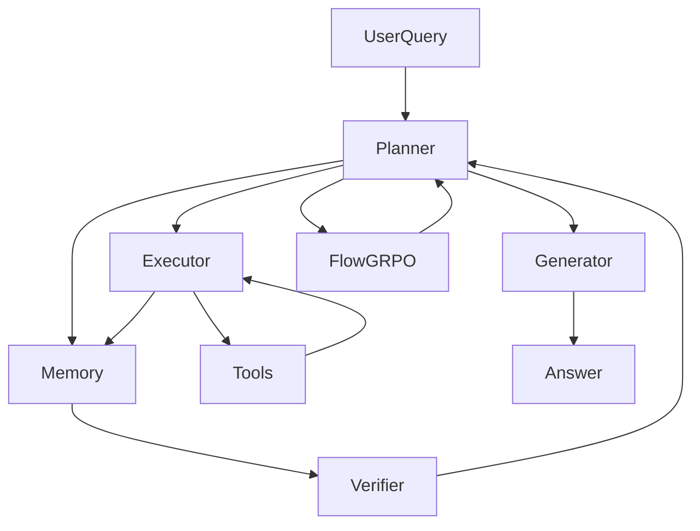

# AgentFlowで体験するFlow-GRPOエージェント開発ガイド
最終更新日: 2025-11-05（コミット 933d3f3、UTC-08 タイムスタンプ 2025-11-04T23:34:46-08:00）、対象バージョン: 0.1.2

## 1. これはなに？
AgentFlowは、スタンフォード大学や産業界の研究者チームが開発したマルチエージェント推論フレームワークで、プランナー・エグゼキュータ・バリデータ・ジェネレータという役割を分離することで、道具を呼び出しながら長い思考を安定させる“in-the-flow”設計を採用しています（[AgentFlow README](https://github.com/lupantech/AgentFlow)）。
Flow-based Group Refined Policy Optimization（Flow-GRPO）によってプランナーをオンライン最適化し、7B級のQwenバックボーンであっても10種類のベンチマーク（検索・エージェント推論・数学・科学）でGPT-4o級モデルを上回るスコアを記録したことが論文と公式サイトで報告されています（[AgentFlow README](https://github.com/lupantech/AgentFlow#-key-features) / [AgentFlow Paper](https://arxiv.org/abs/2510.05592)）。

## 2. 用語の定義
| 用語 | 説明 |
| --- | --- |
| AgentFlow | 4モジュールとツールボックスを備えたエージェント実行・学習フレームワーク。`README.md:64-205`で目的と機能が整理されています。|
| プランナー | クエリ解析・次アクション決定・停止判定・最終回答を担うLLMエージェント。`agentflow/agentflow/models/planner.py:13-399`参照。|
| エグゼキュータ | プランナーが選んだツール用コマンドをLLMで生成し、安全に実行して結果を返す層。`agentflow/agentflow/models/executor.py:54-298`参照。|
| メモリ | 各ステップのサブゴール・コマンド・結果を連想配列で保持する軽量ストア。`agentflow/agentflow/models/memory.py:1-72`参照。|
| Flow-GRPO | GRPO系の方策勾配をマルチターン軌跡に拡張したオンライン最適化手法。構成は論文と`train/config.yaml:23-63`、`agentflow/verl/trainer.py:205-360`に記載。[AgentFlow Paper](https://arxiv.org/abs/2510.05592)|
| ツールボックス | Base_Generator、Python_Coder、Google_Searchなどのツール定義とメタデータ。`agentflow/agentflow/tools/*/tool.py`および`agentflow/agentflow/models/initializer.py:9-288`で読み込まれます。|
| LLMエンジンファクトリ | OpenAI、DashScope、vLLM、Togetherなどを統一インターフェースで呼び出す工場関数。`agentflow/agentflow/engine/factory.py:1-199`参照。|

## 3. 技術・仕組み解説
### 3.1 4モジュールの思考ループ
`agentflow/agentflow/solver.py:12-193`では、(1)クエリ解析→(2)次のサブゴール提案→(3)ツールコマンド生成→(4)実行→(5)検証→(6)最終回答というループが明示されており、各ステップでメモリに履歴を追記しながら最大10ステップもしくはVerifierがSTOPを返すまで継続します。



### 3.2 ツールメタデータとキャッシュ
Initializerは`agentflow/agentflow/models/initializer.py:51-288`で各ツールの`TOOL_NAME`やデモコマンドを走査し、利用可否を判定してからメタデータを格納します。Base_Generatorは汎用回答（`agentflow/agentflow/tools/base_generator/tool.py:5-90`）、Python_Coderは純粋な計算のみ（`agentflow/agentflow/tools/python_coder/tool.py:60-146`）と、役割と制約がコード内の定数で明文化されています。Executorはインスタンスをキャッシュして再利用しつつ、`execution = tool.execute(...)`という形式のコードしか走らないよう`agentflow/agentflow/models/executor.py:206-299`で静的解析とタイムアウト管理を行います。

### 3.3 LLMエンジン抽象化
`agentflow/agentflow/engine/factory.py:5-199`のファクトリは、文字列プレフィックス（`vllm-`, `dashscope-`, `together-`など）に応じて適切なクラスをインポートし、温度やtop_pなどのパラメータを個別にマッピングします。これによりプランナー用の骨格LLMとツール用の補助LLMを簡単に切り替えられます。

### 3.4 Flow-GRPOトレーニング
`train/config.yaml:2-63`でQwen2.5-7B-Instructをベースに、8 GPU・Rollout並列8本・最大プロンプト長18,432トークンといったハイパーパラメータが定義されています。`agentflow/verl/trainer.py:205-360`はRay PPOベースのTrainerを拡張し、(a)ロールアウト結果をDataProtoに詰める、(b)必要に応じてKLペナルティを適用、(c)GRPOのグループ正規化済みアドバンテージを計算、(d)Critic/Actorを更新という流れを提供します。`assets/doc/logs.md:7-78`にあるように、ログはIPベースのディレクトリやrollout JSONとして自動保存されるため追跡が容易です。

### 3.5 データ・ベンチマーク
学習データはNQとDeepMath-103Kをミックスし、`README.md:171-190`でダウンロードコマンドと最終的な`.parquet`構造が示されています。評価は`assets/doc/benchmark.md:1-143`にある`bash scripts/serve_vllm.sh`→`bash test/exp/run_all_models_all_datasets.sh`で自動化され、各タスクの`logs/`と`results/`ディレクトリにスコア・軌跡がまとまります。

## 4. 現状できること/できないこと
**できること**
- 4モジュール分業とメモリで探索・数学・科学を横断するタスクを同じインターフェースで解ける（`README.md:64-190`）。
- ツールごとに異なるLLMエンジンを割り当て、vLLMやDashScopeを同時利用できる（`agentflow/agentflow/engine/factory.py:5-199`）。
- 10ベンチマークを一括実行し、LLM自動採点まで含めた検証パイプラインを保有（`assets/doc/benchmark.md:24-143`）。
- 学習中のログ・rollout・チェックポイントが階層化され、再現性を確保しやすい（`assets/doc/logs.md:7-78`）。

**できない/注意点**
- Python_Coderは外部ライブラリやファイルI/Oを禁止しており、純粋計算以外には使えない（`agentflow/agentflow/tools/python_coder/tool.py:60-112`）。
- APIキー（OpenAI/Google/DashScope/Together）を設定しないとツールや評価が動作しない（`assets/doc/api_key.md:1-96`、`assets/doc/test_env.md:1-49`）。
- 各ツールの実行はシングルスレッド＋タイムアウト制御なので、長時間の外部処理には向かない（`agentflow/agentflow/models/executor.py:200-299`）。
- Flow-GRPO学習は8 GPUや長大なプロンプト長が前提で、リソースが乏しい環境ではそのまま再現できない（`train/config.yaml:2-44`）。

## 5. 使い方解説
### 5.1 セットアップ
`README.md:112-139`の手順どおり、Python 3.11環境で`bash setup.sh && source .venv/bin/activate`を実行し、必要なら`parallel`や追加パッケージもインストールします。`setup.sh:1-71`ではUV仮想環境の作成、agentflowパッケージのeditableインストール、DashScopeやAutoGenなど周辺ライブラリ導入が自動化されています。

### 5.2 APIキーと疎通チェック
`assets/doc/api_key.md:7-96`に従って4種類のキーを`.env`へ設定し、`assets/doc/test_env.md:12-93`で案内されている`bash agentflow/agentflow/tools/test_all_tools.sh`と`python agentflow/scripts/test_llm_engine.py`でツールとLLMの疎通を確認します。

### 5.3 推論を回す
APIキーを入れたら`python quick_start.py`で最小構成を実行できます（`README.md:141-162`）。`quick_start.py:1-13`は`construct_solver`のみを呼び出しており、同関数では`enabled_tools`や`tool_engine`を渡すことで有効化するツールやLLMを細かく指定できます（`agentflow/agentflow/solver.py:195-255`）。

### 5.4 モジュールとエンジンのカスタマイズ
特定ツールだけ有効にしたい場合は`construct_solver(..., enabled_tools=["Base_Generator_Tool","Google_Search_Tool"], tool_engine=["dashscope","Default"])`のように渡し、Initializerが`agentflow/agentflow/models/initializer.py:251-288`でメタデータを再構築します。より強いLLMを使いたいなら、Planner側の`llm_engine_name`に`vllm-Qwen/Qwen2.5-72B-Instruct`、Executor側をDashScope固定など柔軟に切り替えられます（`agentflow/agentflow/engine/factory.py:125-199`）。

### 5.5 Flow-GRPOトレーニング
`python data/get_train_data.py`と`python data/aime24_data.py`でデータをダウンロード後（`README.md:171-190`）、tmuxで`bash train/serve_with_logs.sh`→`bash train/train_with_logs.sh`を起動します（`README.md:192-207`）。環境変数や学習ハイパーパラメータは`train/config.yaml:2-63`、実際の起動コマンド生成は`train/train_agent.py:1-71`にまとまっているため、バッチサイズや温度を変更する場合はここを編集します。ログは`train/train_with_logs.sh:1-62`の通り1MB刻みで分割され`task_logs/<IP>/`に保存されます。

### 5.6 ベンチマークとログ確認
学習済みプランナーをvLLMで提供するときは`bash scripts/serve_vllm.sh`を使い（`assets/doc/benchmark.md:4-23`）、`cd test && bash exp/run_all_models_all_datasets.sh`でタスク群を並列実行します（同:24-143）。結果は`test/<TASK>/results/<MODEL_LABEL>/final_scores_direct_output.json`などにまとまり、`assets/doc/logs.md:7-78`のディレクトリ構造に従ってrolloutも保存されます。

## 6. よくあるQ&A
- **Q. Google Search Toolが失敗します。**  
  **A.** `GOOGLE_API_KEY`が未設定のケースがほとんどなので、`assets/doc/api_key.md:23-35`を参考にキーを取得し、`.env`へ追記した後`python agentflow/scripts/test_llm_engine.py`で再検証してください。`assets/doc/test_env.md:12-67`のテストログにあるように、欠落しているAPIはすぐ検知できます。
- **Q. Quick Startで"Tool not available"エラーが出ます。**  
  **A.** ツール名は外部公開名（例: `Generalist_Solution_Generator_Tool`）で管理されるため、`enabled_tools`を短い内部名で指定するとミスマッチが起きます。`agentflow/agentflow/models/initializer.py:251-288`と`agentflow/agentflow/models/executor.py:206-275`のマッピングに合わせて、長い外部名で渡してください。`bash agentflow/agentflow/tools/test_all_tools.sh`で各ツールが利用可能か事前に確認できます（`assets/doc/test_env.md:16-49`）。
- **Q. Flow-GRPOの検証フェーズが 0% 完了で止まります。**  
  **A.** `AgentModeDaemon`がロールアウトサーバを起こせていない可能性があるので、`agentflow/verl/trainer.py:207-247`で検証データセットやサーバアドレスが正しく設定されているかログを確認し、`train/serve_with_logs.sh`が同じIPで稼働しているか再度チェックしてください。

## 7. 終わりに
Flow-GRPOによる“思考の途中で学習する”アプローチは、NeurIPS 2025 Efficient Reasoning Workshop採択など最近のニュースでも注目を集めています。[AgentFlow News](https://github.com/lupantech/AgentFlow#-news) オープンなツール群とログ構造をうまく活用し、自分のドメイン向けにモジュールやLLMを差し替えてみてください。

## 8. 付録（試しに使えるコード）
```python
from pathlib import Path
from typing import Sequence
from agentflow.agentflow.solver import construct_solver

class BatchAgent:
    """複数クエリをまとめて解かせる小さなユーティリティクラス。"""

    def __init__(self, cache_dir: Path):
        """キャッシュディレクトリを初期化し、必要なら作成する。"""
        self.cache_dir = cache_dir
        self.cache_dir.mkdir(parents=True, exist_ok=True)

    def create_solver(self, llm_engine: str, tools: Sequence[str]) -> None:
        """LLMエンジン名と有効化するツール群からSolverを生成する。"""
        tool_engines = ["dashscope" if "Google" in t else "Default" for t in tools]
        # Solverを生成してインスタンス変数に格納
        self.solver = construct_solver(
            llm_engine_name=llm_engine,
            enabled_tools=list(tools),
            tool_engine=tool_engines,
            root_cache_dir=str(self.cache_dir),
            output_types="final,direct",
            max_steps=6,
            max_time=240,
            temperature=0.3,
        )

    def solve_many(self, queries: Sequence[str]) -> dict[str, str]:
        """与えたクエリ一覧を順番に実行し、最終回答だけを辞書で返す。"""
        results: dict[str, str] = {}
        for q in queries:
            # 1件ずつsolver.solveを呼び、direct_outputを抽出
            output = self.solver.solve(q)
            results[q] = output.get("direct_output", "")
        return results

if __name__ == "__main__":
    runner = BatchAgent(cache_dir=Path("solver_cache"))
    runner.create_solver(
        llm_engine="vllm-Qwen/Qwen2.5-7B-Instruct",
        tools=[
            "Generalist_Solution_Generator_Tool",
            "Python_Code_Generator_Tool",
            "Ground_Google_Search_Tool",
        ],
    )
    answers = runner.solve_many([
        "Who won the 2024 Fields Medal?",
        "Integrate x^2 from 0 to 3",
    ])
    for query, answer in answers.items():
        print(f"Q: {query}\nA: {answer}\n---")
```
`construct_solver`の引数構成やツール接続は`agentflow/agentflow/solver.py:195-293`に沿っており、外部名でツールを指定することでInitializerとExecutorの両方が正しく解決します。
