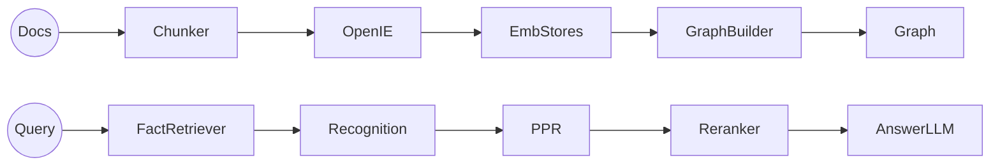

# HippoRAG 2でLLMに「忘れない頭」を持たせる準備をしよう
最終更新日: 2025-09-04（コミット d437bfb）、対象バージョン: 2.0.0-alpha.4

## 1.これはなに？
HippoRAG 2は、外部ドキュメントから抽出した事実をグラフ構造にまとめ、パーソナライズドPageRank(PPR)とLLMを組み合わせて連想的な検索ができるようにした「長期記憶エンジン」です。[From RAG to Memory](https://arxiv.org/abs/2502.14802)は、従来のRAGが苦手だった複雑な文脈理解や多段推論まで高精度でこなせることを報告し、約7%の多段質問改善を示しました。citeturn0search2
さらに[HippoRAG 2解説記事](https://www.marktechpost.com/2025/03/03/hipporag-2-advancing-long-term-memory-and-contextual-retrieval-in-large-language-models/)では、事実記憶・連想・ストーリーベース推論の3領域で既存手法を同時に上回った事例が整理されており、大規模モデルに「忘れない頭」を与える実戦的な選択肢として注目されています。citeturn0search5

## 2.用語の定義
- **RAG (Retrieval-Augmented Generation)**: 質問に答える直前に外部知識を検索してLLMへ補給する仕組み。HippoRAGはベクトル検索だけでなくグラフ検索も併用するのが特徴です。
- **OpenIE (Open Information Extraction)**: 自然文から「主語-述語-目的語」の三つ組を取り出す技術。本リポジトリでは`src/hipporag/information_extraction`配下のモジュールが担当します。
- **Personalized PageRank (PPR)**: グラフ上で特定ノード（ここではクエリに関連する事実）に重みづけして重要度を再計算するアルゴリズム。HippoRAG 2ではクエリに近い事実を起点に関連パッセージを浮かび上がらせます。
- **Recognition Memory Filter**: DSPyベースのフィルター(`DSPyFilter`)で、取り出した事実の中から質問に本当に必要なものだけを残す「人間の再認記憶」のような役割を持ちます。
- **Embedding Store**: `EmbeddingStore`クラスが担当するParquetベースの簡易ベクトルDBで、チャンク・エンティティ・ファクトをそれぞれ独立に保存します。MD5ハッシュでIDを決めるため同じ文章は自動的に重複排除されます。

## 3.技術・仕組み解説
HippoRAG 2は「オフラインで丁寧に知識グラフを構築し、オンライン問い合わせでは軽量に連想検索する」という二段構えです。`HippoRAG.index()`は文書をエンコーダーでチャンク化し、OpenIEでエンティティとトリプルを抽出、`EmbeddingStore`に格納しつつ`igraph`でグラフを作ります。`retrieve()`は①事実ベクトル検索②DSPyによる再認フィルタ③PPRでの多段トラバース④パッセージ再ランクという流れで、情報量過多でも必要な根拠だけを絞り込みます。



コミュニティ向けにまとめられた[HippoRAG2 DeepWikiメモ](https://deepwiki.com/ianliuwd/HippoRAG2)でも、グラフ型表現・マルチホップ検索・複数プロバイダ対応が差別化要素だと整理されています。citeturn0search4 以下はリポジトリ実装で押さえておきたい要素です。
- **多様なLLMバックエンド**: `src/hipporag/llm`ではOpenAI/Azure/Bedrock/vLLM/Transformers離線推論を同一インターフェースで扱えます。`CacheOpenAI`はSQLiteキャッシュ付きでAPIコストを抑制。
- **OpenIEの並列化とキャッシュ**: `OpenIE.batch_openie`は`ThreadPoolExecutor`でNERとトリプル抽出を並列実行し、`CacheOpenAI`により同じプロンプトなら再利用します。
- **グラフ強化処理**: `add_fact_edges`や`synonymy_edge_topk`設定により、ファクト間・チャンク間のエッジを類似度に基づいて自動追加。`retrieve_knn`はGPUで部分的に動作し、高速にシノニム候補を探します。
- **評価とデバッグ**: `tests_openai.py`や`tests_local.py`でエンドツーエンド動作を確認でき、`reproduce/dataset/sample*.json`を使えば小規模セットで高速デバッグが可能です。

## 4.現状できること/できないこと
### 4.1 できること
- 公式GitHubが強調するように、ベクトル×グラフのハイブリッドRAGとしてオンライン応答コストを維持しながら連想能力を底上げできます。citeturn0search6
- OpenAI/Azure/Bedrock/ローカルvLLMを同じコードパスで切り替えられるため、コストやデータレジデンシー要件に合わせて柔軟に運用できます。
- `HippoRAG.delete()`で指定チャンクと関連エンティティ・トリプルを安全に削除でき、長期稼働中の「忘却」機能を実現します。
- `BaseConfig`一つでOpenIEモード(オンライン/オフライン)、エンベディング設定、PPRダンピング係数などをまとめて制御でき、実験パラメータをコード改変なしに切り替えられます。

### 4.2 できないこと・課題
- READMEのTODOにあるように、既存のベクトルDB（MilvusやPGVectorなど）とは直接連携していません。大規模データではParquetベースの`EmbeddingStore`がI/Oボトルネックになる可能性があります。
- OpenIEは現状LLMベースのため、完全にGPU/CPUで閉じた安価なパイプラインにはなりません。vLLMオフラインモードで一部は軽減できますが、初期構築にはそれなりの計算資源が必要です。
- 2025年には[PropRAG](https://arxiv.org/abs/2504.18070)のように命題レベルでビームサーチする手法や、[EcphoryRAG](https://arxiv.org/abs/2510.08958)のようにキューエンティティ中心で軽量化する手法も登場しており、HippoRAG 2との差別化はトリプル＋パッセージ統合と再認フィルタの品質にかかっています。citeturn0academia14turn0academia12

## 5.使い方解説
### 5.1 環境構築の定番手順
```bash
conda create -n hipporag python=3.10
conda activate hipporag
pip install hipporag
export HF_HOME=/path/to/hf_home
export OPENAI_API_KEY=<your key>
```
GPUを複数使う場合は`CUDA_VISIBLE_DEVICES`を設定し、ローカルLLMなら別ターミナルで`vllm serve`を起動します。

### 5.2 最小コード例
```python
from hipporag import HippoRAG
from hipporag.utils.config_utils import BaseConfig

def build_demo_instance(save_dir: str) -> HippoRAG:
    """HippoRAGインスタンスを初期化して返すユーティリティ関数。"""
    config = BaseConfig(
        save_dir=save_dir,
        llm_name="gpt-4o-mini",
        embedding_model_name="nvidia/NV-Embed-v2",
        retrieval_top_k=20,
        openie_mode="online"
    )
    return HippoRAG(global_config=config)

def run_demo():
    """サンプル文書を登録して質問応答を一気に試すデモ関数。"""
    hippo = build_demo_instance("outputs/openai_demo")
    docs = [
        "George Rankin is a politician.",
        "Montebello is a part of Rockland County.",
        "When the slipper fit perfectly, Cinderella was reunited with the prince."
    ]
    hippo.index(docs)
    queries = ["What county is Montebello in?"]
    # rag_qaはクエリから自動でRetrieval→LLM回答まで実行
    results, answers, _ = hippo.rag_qa(queries=queries)
    print(answers[0])

if __name__ == "__main__":
    run_demo()
```
`demo_openai.py`や`demo_local.py`でも同じミニ文書を使っており、エンドポイントやモデル名だけ変えればクラウド/オンプレをシームレスに行き来できます。

### 5.3 再現実験スクリプトを使う
1. `reproduce/dataset`配下にある`*_corpus.json`と`*.json`を確認し、独自データの場合も同じ構造で用意します。
2. `python main.py --dataset musique --llm_name gpt-4o-mini --embedding_name nvidia/NV-Embed-v2`のように実行します。
3. `outputs/<dataset>`配下にチャンク・エンティティ・ファクトそれぞれのParquetと`igraph`バイナリが作成され、そのまま増分更新が可能です。

## 6.よくあるQ&A
- **Q. GPUは必須？**  
  A. OpenAIやAzureなどホステッドLLMを使うなら必須ではありませんが、OpenIEと再ランクをすべて自前で回す場合は少なくとも1枚のGPUがあった方が実用的です。
- **Q. インデックスを作り直さずにドキュメントだけ追加したい。**  
  A. `HippoRAG.index()`はハッシュで既存チャンクを判定するため、既に登録済みの文章は自動でスキップされます。追加分だけOpenIE→グラフ更新が走ります。
- **Q. コストを抑えるには？**  
  A. `openie_mode="offline"`にしてvLLMで命名体・トリプル抽出をバッチ処理する、`CacheOpenAI`を活かすために`save_dir`ごとにキャッシュを残す、などでAPIトークン消費を減らせます。
- **Q. 評価指標はどこで設定？**  
  A. `BaseConfig`の`max_qa_steps`や`qa_top_k`を変えると、`rag_qa`内部でExact Match/F1を計測する際のドキュメント枚数やステップ数を制御できます。

## 7.終わりに
HippoRAG 2はグラフ構造を活用しつつオンライン遅延とコストを抑えられるバランスが魅力です。今後は命題探索型の[PropRAG](https://arxiv.org/abs/2504.18070)やエンティティ中心の[EcphoryRAG](https://arxiv.org/abs/2510.08958)と組み合わせたハイブリッド設計も視野に入るでしょう。citeturn0academia14turn0academia12 手を動かしやすいミニスクリプトと充実した設定ファイルが揃っているので、まずはサンプルデータで「忘れない頭」の作り方を体験してみてください。

## 8.付録
### 8.1 実行用コード一式
```python
import json
from pathlib import Path
from hipporag import HippoRAG
from hipporag.utils.config_utils import BaseConfig

def load_corpus(dataset_name: str) -> list[str]:
    """指定データセットのコーパスJSONを読み込んで文字列リストに変換する。"""
    corpus_path = Path("reproduce/dataset") / f"{dataset_name}_corpus.json"
    with corpus_path.open() as f:
        corpus = json.load(f)
    return [f"{doc['title']}\n{doc['text']}" for doc in corpus]

def load_queries(dataset_name: str) -> tuple[list[str], list[list[str]]]:
    """質問文と模範解答をセットで読み込むヘルパー。"""
    query_path = Path("reproduce/dataset") / f"{dataset_name}.json"
    samples = json.loads(query_path.read_text())
    questions = [sample["question"] for sample in samples]
    gold_answers = []
    for sample in samples:
        answer = sample.get("answer") or sample.get("gold_ans") or sample.get("reference")
        gold_answers.append([answer] if isinstance(answer, str) else answer)
    return questions, gold_answers

def run_pipeline(dataset_name: str = "sample") -> None:
    """データ読み込みからインデックス作成、QA評価までを一括実行する。"""
    docs = load_corpus(dataset_name)
    questions, gold_answers = load_queries(dataset_name)
    config = BaseConfig(
        save_dir=f"outputs/{dataset_name}",
        llm_name="gpt-4o-mini",
        embedding_model_name="nvidia/NV-Embed-v2",
        rerank_dspy_file_path="src/hipporag/prompts/dspy_prompts/filter_llama3.3-70B-Instruct.json",
        max_qa_steps=3,
        qa_top_k=5,
        retrieval_top_k=50
    )
    hippo = HippoRAG(global_config=config)
    hippo.index(docs)
    _, answers, metrics, retrieval_scores, qa_scores = hippo.rag_qa(
        queries=questions,
        gold_answers=gold_answers,
        gold_docs=None
    )
    print("回答例:", answers[0])
    print("QA評価:", qa_scores)

if __name__ == "__main__":
    run_pipeline("sample")
```

### 8.2 サンプルJSONスケルトン
HippoRAGが期待する`*_corpus.json`と`*.json`の最小例です。必要に応じて`idx`や`paragraphs`を増やしてください。

```json
[
  {
    "title": "Sample Passage",
    "text": "Alice founded the Wonderland Research Lab in 2018.",
    "idx": 0
  }
]
```

```json
[
  {
    "id": "sample/question_1.json",
    "question": "Where does Alice work?",
    "answer": ["Wonderland Research Lab"],
    "answerable": true,
    "paragraphs": [
      {
        "title": "Sample Passage",
        "text": "Alice founded the Wonderland Research Lab in 2018.",
        "is_supporting": true,
        "idx": 0
      }
    ]
  }
]
```
