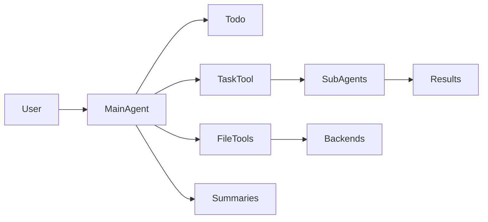

# Claude Code発のディープエージェントを自前で運用する：deepagents徹底ガイド
最終更新日: 2025-11-06（コミット 9ed6483）、対象バージョン: 0.2.5

## 1. これはなに？
`deepagents`はLangChain/LangGraph製のPythonパッケージで、LLMに「計画立案」「ファイル操作」「サブエージェント起動」といった深い推論パターンを組み込み、Claude Codeのような長時間タスクに耐えるエージェントを最小コードで構築できるツールキットです。[Deep Agents Overview](https://docs.langchain.com/oss/python/deepagents/overview)では、単純なツール呼び出しループでは解けない複雑タスクに対して、トゥードゥリストやファイルシステムを併用することが推奨されています。本家のDeep ResearchテンプレートやManusなどと同じ思想で、調査・コーディング・文書作成などを「深く」遂行するエージェントを自由に作れます。

## 2. 用語の定義
- **Deep Agent**: ツール呼び出しだけでなく、計画更新・メモリ管理・サブタスク委譲を自律的に行うエージェント像。
- **LangGraph**: LangChainの状態遷移エンジン。`create_deep_agent`はLangGraphグラフを返すため、Streamingやメモリ共有をそのまま利用可能。
- **Middleware**: エージェントに追加機能を挿す仕組み。TodoList、Filesystem、SubAgent、Summarization、PromptCaching、PatchToolといったミドルウェアが標準で差し込まれています（`libs/deepagents/graph.py`）。
- **Backend**: ファイル永続化の抽象。状態メモリに書く`StateBackend`、実ファイルを扱う`FilesystemBackend`、LangGraph Storeへ保存する`StoreBackend`、そして用途ごとに振り分ける`CompositeBackend`があります。
- **SubAgent**: `task`ツール経由で起動される短命な子エージェント。用途に応じたプロンプト／ツール／モデルを割り当てて隔離実行できます（`libs/deepagents/middleware/subagents.py`）。
- **Interrupt Hook**: `interrupt_on`設定で紐付くHuman-in-the-Loop機能。危険なツール実行の前に人間の承認を挟めます。

## 3. 技術・仕組み解説
`create_deep_agent`は、モデルを指定しなくても`claude-sonnet-4-5-20250929`（最大20kトークン）を自動で使い、以下のミドルウェアスタックを一括で組み上げます。
- **TodoListMiddleware**: `write_todos`ツールを組み込み、複雑タスクを段階的に追跡。
- **FilesystemMiddleware**: `ls`/`read_file`/`write_file`/`edit_file`/`glob_search`/`grep_search`を提供。内部ではパス正規化と500行ペジネーション、1行2000文字の安全対策を実装し、任意のBackendを差し替えられます（`libs/deepagents/middleware/filesystem.py`）。
- **SubAgentMiddleware**: `task`ツールを通じて汎用サブエージェント＋任意のカスタムエージェントを起動。デフォルトではメインと同じツール群とモデルを持つ"general-purpose"エージェントを自動登録し、必要に応じてHumanInTheLoopMiddlewareも追加します。
- **SummarizationMiddleware**: 170kトークンを超える前にLangChainの要約を走らせ、最後の6メッセージを保持したまま古い履歴を圧縮。
- **AnthropicPromptCachingMiddleware**と**PatchToolCallsMiddleware**: キャッシュ可能なプロンプトをAnthropic系モデルで節約し、未応答のtool callに自動キャンセルメッセージを補う安全網。

バックエンドは、会話スレッド内で閉じる`StateBackend`（`ToolRuntime.state`に格納）、ローカルファイルを安全に扱う`FilesystemBackend`（仮想ルートでディレクトリトラバーサル防止）、LangGraph Storeに書く`StoreBackend`、用途ごとにルーティングする`CompositeBackend`から選択可能です。必要なら`ResumableShellToolMiddleware`（`libs/deepagents/middleware/resumable_shell.py`）を追加し、HITL一時停止後でもシェルセッションを復元できます。



## 4. 現状できること/できないこと
- できること
  - トゥードゥ管理、ファイル編集、サブエージェント起動を一括で有効化した総合エージェントを数行で構築。
  - `interrupt_on`により危険ツールを人間承認フローへ自動的にルーティング。
  - `middleware`引数で独自の監視・ロギング・shell中断復帰などを追加。
  - LangGraph Storeを組み合わせれば会話を跨いだ長期メモリを構築可能。
  - MCPアダプタ経由でMCPツール群を読み込み、LangGraphのasyncストリームにも対応（MCP例はREADME参照）。
- できない/注意点
  - デフォルトBackendはスレッド内の揮発的なStateBackendなので、永続的な知識ベースが必要な場合はStoreBackendか独自Backendを差し込む必要があります。
  - 自動でコードを実行する実行環境は含まれません。shellやPython実行は別途ツール実装が必要です。
  - MCPツールを同期エージェントに直接混在させることは推奨されず、非同期版（`async_create_deep_agent`）を使う必要があります。
  - SubAgentはステートレスな単発実行なので、逐次対話が必要なタスクには不向きです。

## 5. 使い方解説
1. **インストール**: `pip install deepagents tavily-python` もしくは `uv add deepagents tavily-python`。プロジェクトにPoetryを使う場合は `poetry add deepagents`。
2. **環境変数**: 例としてWeb検索ツールに[Tavily](https://www.tavily.com/)を使うなら`TAVILY_API_KEY`を設定。
3. **ツール定義**: Python関数やLangChain Toolを定義。`deepagents/examples/research/research_agent.py`では`internet_search`をLiteral型付きで定義し、API呼び出しをまとめています。
4. **サブエージェント設計**: `subagents`リストに辞書を入れ、`name`/`description`/`system_prompt`/`tools`（必要なら`model`/`middleware`）を指定。校閲用とリサーチ用など役割を分離すると、コンテキスト汚染を避けられます。
5. **エージェント生成**: `create_deep_agent(tools=[...], system_prompt=..., subagents=[...], backend=lambda rt: StateBackend(rt))`のように呼び出し。`response_format`で構造化出力、`checkpointer`でLangGraphの永続チェックポイント、`interrupt_on`でHITL設定を追加可能です。
6. **実行**: `.invoke({"messages": [{"role": "user", "content": "調査テーマ"}]})`で同期実行、`.astream`でストリーム、`.with_config({"recursion_limit": 1000})`が既定で入るため深い再帰も心配無用です。
7. **MCP連携**: [LangChain MCP Adapter](https://github.com/langchain-ai/langchain-mcp-adapters)と組み合わせれば、MCPで公開されたローカルツール群を一括で取り込み可能。READMEのasync例では`agent.astream`でMCPツールを含む結果を順次受け取ります。

## 6. よくあるQ&A
**Q1. どのモデルを使うべき？** 既定ではClaude Sonnet 4.5（2025-09-29版）が選ばれますが、`model=init_chat_model("openai:gpt-4o")`のようにLangChain互換モデルで差し替え可能です。低コスト用途なら`gpt-4o-mini`などを指定すると良いでしょう。

**Q2. ファイルの永続化はどうすればいい？** デフォルトの`StateBackend`はスレッド終了で消えるため、LangGraph Storeがある環境では`backend=lambda rt: StoreBackend(rt)`を設定し、`store`引数に`BaseStore`を渡します。クラウドストレージやデータベース連携をしたい場合は`BackendProtocol`を満たすクラスを自作します。

**Q3. 人間の承認を挟みたい** `interrupt_on={"internet_search": {"allowed_decisions": ["approve","edit","reject"]}}`のように辞書を渡すと、自動的にHumanInTheLoopMiddlewareが追加され、指定ツールの前で実行が停止します。

**Q4. 文脈が長くなりすぎませんか？** SummarizationMiddlewareが170kトークンを閾値にして履歴を圧縮します。さらに`FilesystemMiddleware`の`write_file`に長文抜粋を退避すれば、必要なときに`read_file`で再読込できます。

## 7. 終わりに
`deepagents`は「Claude Codeの良いところを抽象化したLangChain製品」という位置づけで、計画・記録・委譲の3点をコード数十行で組み込めます。既存のLangGraph資産（チェックポインタ、Store、Studio）とも親和性が高く、研究支援からコードベース改造まで幅広いシナリオで利活用できます。まずはシンプルな検索ツールから接続し、徐々にサブエージェントや中断復帰用ミドルウェアを足していくのがおすすめです。

## 8. 付録（試せるコード一式）
```python
"""ニュースリサーチ用Deep Agentを構築・実行するサンプルスクリプト"""
import os
from typing import Literal

from deepagents import CompiledSubAgent, create_deep_agent
from deepagents.backends import StateBackend
from langchain.agents import create_agent
from langchain.chat_models import init_chat_model
from langchain_core.tools import tool
from tavily import TavilyClient

TAVILY_API_KEY = os.environ["TAVILY_API_KEY"]
tavily_client = TavilyClient(api_key=TAVILY_API_KEY)

@tool
def save_outline(filename: str, content: str) -> str:
    """取材メモをファイルに保存する軽量ツール"""
    with open(filename, "w", encoding="utf-8") as f:
        f.write(content)
    return f"保存完了: {filename}"

@tool
def internet_search(
    query: str,
    max_results: int = 5,
    topic: Literal["general", "news", "finance"] = "general",
    include_raw_content: bool = False,
) -> dict:
    """Tavily検索で最新記事を集める"""
    return tavily_client.search(
        query,
        max_results=max_results,
        include_raw_content=include_raw_content,
        topic=topic,
    )

@tool
def summarizer(text: str, instruction: str = "要点だけまとめて") -> str:
    """LangChainモデルで即席サマリを生成する"""
    model = init_chat_model("openai:gpt-4o-mini")
    return model.invoke([
        {"role": "system", "content": instruction},
        {"role": "user", "content": text},
    ]).content  # type: ignore[return-value]

subagent_prompt = (
    """あなたは批判的な校閲者です。`final_report.md`を読み、論理の穴や不足を列挙してください。"""
)

subagent_graph = create_agent(
    model="openai:gpt-4o-mini",
    tools=[summarizer],
    system_prompt=subagent_prompt,
)

critique_agent = CompiledSubAgent(
    name="critique-agent",
    description="レポートの校閲を専門に行うサブエージェント",
    runnable=subagent_graph,
)

SYSTEM_PROMPT = """あなたは国際ニュース専門の主任リサーチャーです。常に情報源と根拠を残してください。"""

interrupt_policy = {
    "internet_search": {"allowed_decisions": ["approve", "edit", "reject"]}
}

agent = create_deep_agent(
    tools=[internet_search, save_outline],
    system_prompt=SYSTEM_PROMPT,
    subagents=[critique_agent],
    backend=lambda runtime: StateBackend(runtime),
    interrupt_on=interrupt_policy,
)

if __name__ == "__main__":
    # 日本語で質問を投げれば日本語でTodoとレポートが生成される
    result = agent.invoke(
        {"messages": [{"role": "user", "content": "今日のAI規制ニュースを調べて要約して"}]}
    )
    print(result["messages"][-1].content)
```

実行前に`pip install deepagents tavily-python langchain tavily`などで依存関係を入れ、`TAVILY_API_KEY`を設定してから`python news_agent.py`を実行してください。
