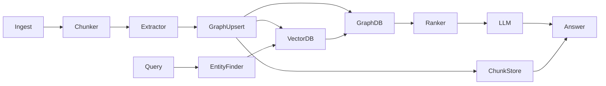

# Fast GraphRAGでグラフRAGを高速に回す実践ガイド
最終更新日: 2025-11-01（コミット 23b3a1b）、対象バージョン: 0.0.5

## 1.これはなに？
GraphRAGは、テキストから自動生成した知識グラフを使ってLLMの検索精度と説明性を同時に高める手法で、Microsoft Researchが公開したリファレンス実装によって「複雑なデータ探索をグラフで見える化する」というコンセプトが広まりました[GraphRAG: New tool for complex data discovery now on GitHub](https://www.microsoft.com/en-us/research/blog/graphrag-new-tool-for-complex-data-discovery-now-on-github/)。同研究所は、物語のような長文データでも出典付きで回答できることを重視しており、GraphRAGが読み解いた情報の来歴をたどれる点を特長としています[GraphRAG: Unlocking LLM discovery on narrative private data](https://www.microsoft.com/en-us/research/blog/graphrag-unlocking-llm-discovery-on-narrative-private-data/)。

Circlemindが公開したfast-graphragは、このアイデアを実務向けに磨き、安価で高速に動くよう最適化したフレームワークです。同じ『オズの魔法使い』を取り込むテストでは、公式GraphRAGより6倍（$0.48→$0.08）のコスト削減を示しています[circlemind-ai/fast-graphrag README](https://github.com/circlemind-ai/fast-graphrag)。さらに、非同期実行・型ヒント・拡張しやすいサービス層のおかげで、自社ドメイン知識に合わせたエージェント型RAGを短期間で構築できます。

## 2.用語の定義
- **GraphRAG**: Retrieval-Augmented Generationをグラフ構造で拡張し、距離ではなく関係性で関連知識を探す手法。
- **エンティティ／リレーション**: テキストから抽出した「登場人物や製品」などのノードと、それらのつながり（例: "SCROOGE -> VISITS -> CRATCHIT"）。
- **パーソナライズドPageRank**: クエリに近いノードから確率的に散歩し、重要ノードを順位付けするアルゴリズム。fast-graphragではigraphの`personalized_pagerank`をラップして使います。
- **HNSW (Hierarchical Navigable Small World)**: 高速な近似近傍探索アルゴリズム。デフォルトのベクターストア`HNSWVectorStorage`で利用され、ローカル環境でも高速なエンベディング検索を実現します。
- **Workspace/Checkpoint**: ワーキングディレクトリに保存される状態管理。`n_checkpoints`を設定すると途中失敗時に自動ロールバックできます。
- **QueryParam**: 回答生成時のフラグ。`with_references`で引用付き回答、`only_context`でコンテキストだけを取得、`*_max_tokens`でLLMへの投入量を制御します。
- **Gleaning**: LLMが「もう少し関係を掘り下げられるか」を自己判断し、追加の事実抽出を試みるフェーズ。fast-graphragはチャンクごとに非同期でこれを行います。
- **CONCURRENT_TASK_LIMIT**: 環境変数で設定する並列LLM実行数。ローカルGPUや制限付きAPIで暴走を防ぎます。

## 3.技術・仕組み解説
fast-graphragは`GraphRAG`クラス（`fast_graphrag/__init__.py`）にパイプラインを集約し、サービス層を差し替え可能にしています。

### 3.1 インデックス構築パイプライン
1. **チャンク分割**: `DefaultChunkingService`（`_services/_chunk_extraction.py`）が句読点や空行でテキストを分割し、約800トークン・オーバーラップ100トークンの塊に整形。`xxhash`でハッシュ化し重複を除去します。
2. **エンティティ抽出**: `DefaultInformationExtractionService`が各チャンクをLLMへ投げ、エンティティとリレーションのサブグラフを並列生成。必要に応じてGleaningで追加質問を行い、`BaseGraphUpsertPolicy`に渡します。
3. **グラフ整合化**: `NodeUpsertPolicy_SummarizeDescription`が同名ノードの説明を結合して要約し、`EdgeUpsertPolicy_UpsertValidAndMergeSimilarByLLM`が重複エッジをマージします。`DefaultStateManagerService`は類似度0.9以上のエンティティ同士に「is」エッジを追加し、ベクターストアへエンベディングを保存します。
4. **ストレージ永続化**: igraphベースの`DefaultGraphStorage`、HNSWの`DefaultVectorStorage`、pickleキー値ストアが`Workspace`配下に同期され、必要なら`save_graphml`でGraphML出力もできます。

### 3.2 クエリパイプライン
1. **エンティティ抽出**: `query()`はまず質問から固有名詞と一般語句を抽出し、ベクターストアに対して類似ノードを探索。
2. **スコアリング**: 類似スコアを`RankingPolicy_WithThreshold`/`RankingPolicy_TopK`で剪定し、igraphのPersonalized PageRankでグラフ内の重要ノードを再ランク。
3. **コンテキスト構築**: ノード→リレーション→チャンクへとスコアを伝搬し、`TContext`に格納。`TOKEN_TO_CHAR_RATIO`(4)を用いてトークン上限を文字数で裁断します。
4. **回答生成**: `format_and_send_prompt`が`PROMPTS["generate_response_query_*"]`を呼び出し、必要に応じて引用ID付き回答を生成します。`response_model`を渡せば型安全な構造化応答も可能です。

### 3.3 外部知見との整合
- Microsoftのクエリエンジン設計では、グローバル要約とローカル証拠の二層で回答を作る方針が示されており[GraphRAG Query Engine Overview](https://microsoft.github.io/graphrag/query/overview/)、fast-graphragの「ページランク＋チャンク参照」構造はこの原則を忠実に実装しています。
- 最新の研究では、プロンプトを段階的に書き換えてエージェント制御を行うPROPEX-RAGのような発展も出ています[Prompt-Rewriting for Orchestrating Efficient RAG Workflows (PROPEX-RAG)](https://arxiv.org/abs/2511.01802)。fast-graphragのポリシー層や`Config`クラスを差し替えることで、こうした実験も行いやすくなっています。

### 3.4 関係図


## 4.現状できること/できないこと
### できること
- `GraphRAG.Config`でLLM・埋め込み・チャンク分割・ストレージ・ランキングポリシーを一括カスタマイズ。
- `Workspace`のチェックポイント管理で、途中失敗時も自動ロールバックしやすい。
- `QueryParam(with_references=True)`で回答に参照番号を付与、`save_graphml()`で外部可視化ツールに渡せる。
- 公式Gemini例のようにOpenAI互換APIであれば任意プロバイダを差し替え可能（`examples/gemini_example.py`）。
- `CONCURRENT_TASK_LIMIT`でLLM呼び出しを制限し、低リソース環境でも安定動作。

### できないこと・制約
- `InsertParam`はまだ空実装で、ドメイン別の細かな挿入設定は自作が必要。
- `BaseStateManagerService.node_specificity`は未実装フラグで、有効化すると`NotImplementedError`になります。
- Graph構造は単一マシンのigraph/ファイルベース前提。大規模分散グラフや外部GraphDBへの直接書き込みは自前実装が必要。
- Gleaningの繰り返し回数は`max_gleaning_steps`（デフォルト0）に縛られ、挙動を増やすには派生クラスで明示設定が必要。
- マネージド版にある監視・認証はOSSには含まれないため、自身でAPI管理を行う必要があります[circlemind docs](https://docs.circlemind.co/quickstart)。

## 5.使い方解説
### 5.1 インストール
```bash
# 推奨: ソースからPoetryインストール
cd fast-graphrag
poetry install

# PyPIから最小セットで導入する場合
pip install fast-graphrag
```

### 5.2 初期設定
```bash
export OPENAI_API_KEY="sk-..."
# 並列実行を抑えたい場合（例: 8スレッド）
export CONCURRENT_TASK_LIMIT=8
```
1. `mock_data.txt`など手元のテキストを`book.txt`として保存。
2. 任意の作業用フォルダ（例: `./book_example`）を指定。
3. `entity_types`に抽出したいラベル（Character, Placeなど）を設定。

### 5.3 最小実行スクリプト
```python
from fast_graphrag import GraphRAG

gr = GraphRAG(
    working_dir="./book_example",
    domain="Analyze Dickens' A Christmas Carol",
    example_queries="\n".join([
        "Who is Scrooge?",
        "Why are spirits divided into staves?",
    ]),
    entity_types=["Character", "Place", "Event"],
)

with open("book.txt") as f:
    gr.insert(f.read())

print(gr.query("What changes Scrooge?").response)
```
ポイント:
- `working_dir`を変えなければ、次回起動時もインデックスが再利用されます。
- `insert()`は文字列や文字列リスト、メタデータ辞書を受け取れます。

### 5.4 LLMを差し替える
`examples/custom_llm.py`や`examples/gemini_example.py`を参考に、`GraphRAG.Config`へ任意のLLM/Embeddingサービスを渡します。
```python
from fast_graphrag import GraphRAG
from fast_graphrag._llm import GeminiLLMService, GeminiEmbeddingService

gr = GraphRAG(
    working_dir="./stories",
    domain="Story graph",
    example_queries="",
    entity_types=["Character"],
    config=GraphRAG.Config(
        llm_service=GeminiLLMService(model="gemini-2.0-flash", api_key="${GEMINI_API_KEY}"),
        embedding_service=GeminiEmbeddingService(api_key="${GEMINI_API_KEY}"),
    ),
)
```

## 6.よくあるQ&A
- **Q1: ドキュメントを更新したときに全部再処理する必要がありますか？**  
  **A1:** いいえ。`DefaultChunkingService`がチャンクごとにxxhashを付け、`chunk_storage.mask_new`で新規チャンクだけを処理します。追記分だけ再インデックスされるためコストを抑えられます。
- **Q2: 引用付き回答がほしいのですが？**  
  **A2:** `gr.query("質問", QueryParam(with_references=True))`とすると、回答テキストに参照番号が付き、`response.context`からどのチャンクを使ったかも取得できます。
- **Q3: 途中で失敗した場合にデータが壊れるのが不安です。**  
  **A3:** `GraphRAG(..., n_checkpoints=3)`のように指定すると、`Workspace`が最新3世代のスナップショットを保存し、`with_checkpoints`で安全にロールバックします。
- **Q4: マネージドサービスとOSS版はどう違いますか？**  
  **A4:** OSS版は自分でインフラを運用する代わりに完全に自由に拡張できます。Circlemindのマネージド版は月100リクエストまで無料トライアルがあり、GUIや監視が付属します[circlemind-ai/fast-graphrag README](https://github.com/circlemind-ai/fast-graphrag)。

## 7.終わりに
GraphRAGは「どの文章を根拠に答えたか」を明示できるRAGとして注目されています。fast-graphragはその仕組みを軽量かつ拡張性の高いPythonライブラリに落とし込み、LLMアプリを素早くプロダクションに載せたいチームを後押しします。まずは小さなテキストから試し、ポリシーやLLMサービスを差し替えながら自分たちのドメイン知識に最適化していきましょう。

## 8.付録: すぐ試せるコード一式
```python
"""fast-graphragの最小実験用スクリプト。"""
from pathlib import Path
from typing import List

from fast_graphrag import GraphRAG, QueryParam

WORKING_DIR = Path("./workspace_demo")
SAMPLE_TEXT = """
タイトル: 未来都市ガイド
- 都市AIは市民の予定を最適化する。
- エネルギー網は再生可能エネルギーで閉じる。
- 主人公アキラはAI整備士として市内を巡回する。
""".strip()


def prepare_rag() -> GraphRAG:
    """GraphRAGインスタンスを作り、サンプル文章を投入する。"""
    grag = GraphRAG(
        working_dir=str(WORKING_DIR),
        domain="未来都市の仕組みを説明して",
        example_queries="\n".join([
            "都市AIは何を管理しますか？",
            "主人公アキラの役割は？",
        ]),
        entity_types=["Character", "System", "Place"],
    )
    # メタデータ付きで文章を登録しておく
    grag.insert(
        content=SAMPLE_TEXT,
        metadata={"source": "futuristic-notes.md", "section": "intro"},
    )
    return grag


def run_queries(grag: GraphRAG, questions: List[str]) -> None:
    """複数の質問を走らせ、引用付きで結果を表示する。"""
    params = QueryParam(with_references=True, entities_max_tokens=2000, relations_max_tokens=1500, chunks_max_tokens=4000)
    for q in questions:
        response = grag.query(q, params=params)
        print(f"\nQ: {q}")
        print(f"A: {response.response}")
        # どのチャンクが使われたかを簡単に追跡
        for chunk, score in response.context.chunks:
            print(f"  - chunk score={score:.2f}, source={chunk.metadata.get('source')}")


def main() -> None:
    """スクリプト全体のエントリーポイント。"""
    WORKING_DIR.mkdir(exist_ok=True)
    grag = prepare_rag()
    run_queries(
        grag,
        [
            "都市AIの役割は？",
            "アキラはどんな仕事？",
        ],
    )


if __name__ == "__main__":
    main()
```
