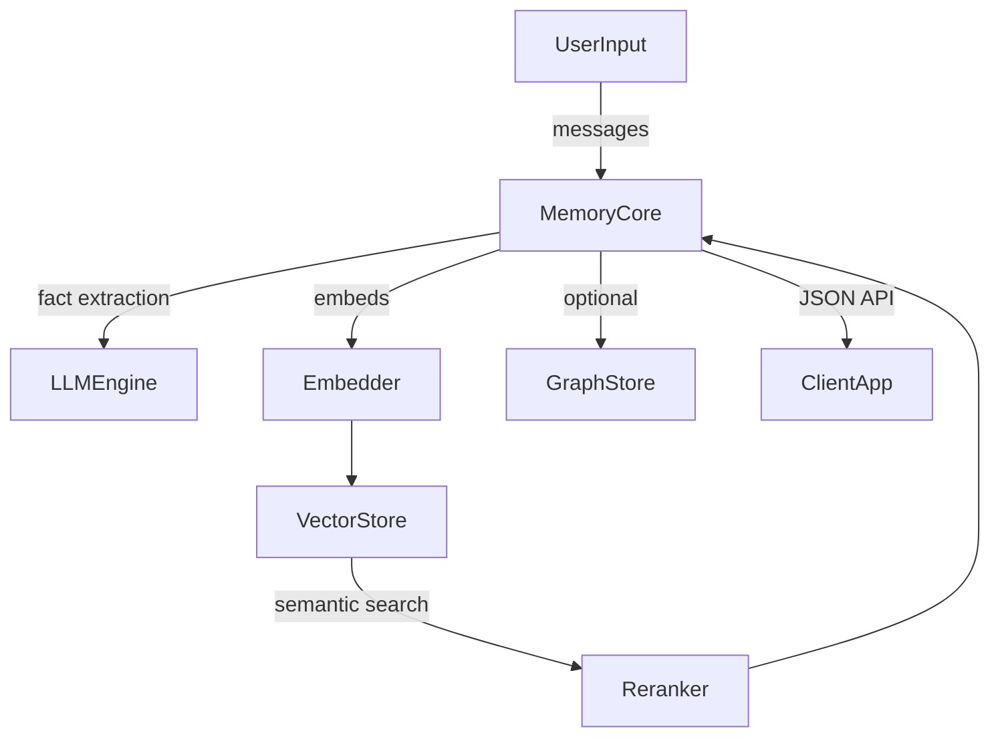

# AIに“忘れない頭脳”を与えるMem0ガイド
最終更新日: 2025-11-07（コミット 568e97d0）、対象バージョン: 1.0.0

## 1. これはなに？
Mem0は、大規模言語モデル（LLM）が苦手とする長期記憶を肩代わりする“記憶レイヤー”です。Retrieval-Augmented Generation（RAG）が静的データ検索に強い一方で、ユーザーの嗜好や状況の変化を逐次反映するのは不得手という課題に対し、Mem0は対話から重要情報を抽出・更新・検索する専門パイプラインを提供し、パーソナライズされたAI体験を継続的に維持します。[Introducing Mem0](https://mem0.ai/blog/introducing-mem0)

公式サイトでは、Mem0を使うことでOpenAI Memory対比で最大+26%の応答精度、91%のレイテンシ削減、90%のトークン節約が得られると紹介されており、SOC2/HIPAA準拠やゼロトラスト構成などエンタープライズ向けの運用面も強調されています。[Mem0 - The Memory Layer for your AI Apps](https://mem0.ai/)

スタートアップとしても勢いがあり、2025年10月28日にはBasis Set VenturesやPeak XVらから2,400万ドルのシリーズA（シード込み）調達を発表し、「AIアプリの標準記憶層」を目指すと述べています。[Mem0 raises $24M from YC, Peak XV and Basis Set](https://techcrunch.com/2025/10/28/mem0-raises-24m-from-yc-peak-xv-and-basis-set-to-build-the-memory-layer-for-ai-apps/) さらに公式発表によると、数千社以上の開発チームが本番環境で採用済みです。[Mem0 Series A announcement](https://mem0.ai/series-a)

## 2. 用語の定義
- **Memory（OSS）**: `mem0/memory/main.py`に実装されたクラス。LLM・埋め込み・ベクタDB・（任意）グラフDB・リランカーを束ね、`add/search/update/delete/reset/history`を提供。
- **MemoryClient（プラットフォーム）**: `mem0/client/main.py`。Hosted APIへHTTPで接続し、APIキーから自動生成したユーザーIDで各種操作を非同期実行。
- **メモリ層の種類**: `docs/core-concepts/memory-types.mdx`にあるConversation / Session / User / Org。短期～長期の階層を分離し、必要な粒度だけを検索に混ぜる設計。
- **Graph Store**: `GraphStoreFactory`経由でNeo4jやNeptuneなどにエンティティ・関係を保存する層。関係性検索を`relations`として返却可能。
- **Vector Store**: `mem0/vector_stores/configs.py`で定義された30種以上のベクタDB設定（Qdrant, pgvector, Pinecone, FAISSなど）。
- **Reranker**: `mem0/configs/rerankers`の設定でCohereやSentenceTransformer等を用い、検索結果を文脈に沿って並び替える層。
- **Telemetry/History**: `mem0/memory/storage.py`のSQLiteで各メモリの変更履歴を保持。`capture_event`で利用状況トラッキングも可能。
- **OpenMemory**: `openmemory/README.md`のローカルフルスタック（FastAPI + Next.js）。自分専用メモリをブラウザで確認でき、MCPクライアントとも連携。
- **REST API Server**: `server/main.py`のFastAPI実装。HTTP越しにOSS APIを公開するブリッジ。

## 3. 技術・仕組み解説
### 3.1 メモリパイプライン
`Memory.add()`は`docs/core-concepts/memory-operations/add.mdx`で解説されるとおり、①対話メッセージをLLMで要約・事実抽出し、②既存メモリと衝突判定し、③ベクタストアと（任意で）グラフに保存する三段構成です。`_build_filters_and_metadata()`により`user_id`・`agent_id`・`run_id`のいずれかが必須で、セッション境界を厳格にします。埋め込み生成は`EmbedderFactory`（OpenAI/VertexAI/Ollamaなど）で抽象化され、保存先は`VectorStoreFactory`が担います。`GraphStoreFactory`を有効化すると、Neo4jやMemgraphへ抽出済みのエンティティ・関係を合わせて登録できます。

検索 (`Memory.search`) では同じフィルター情報を使って対象メモリを絞り込み、必要に応じて`RerankerFactory`（Cohere等）で再ランキング、`graph`有効時は関係も返却します。結果は`MemoryItem`（`mem0/configs/base.py`）として正規化され、スコア閾値や論理演算付きのメタデータフィルターにも対応しています。



### 3.2 設定とエコシステム
- **Config**: `MemoryConfig`（`mem0/configs/base.py`）がLLM・Embedder・VectorStore・Reranker・Graph・履歴DBを一括管理。`docs/open-source/configuration.mdx`ではPython dict／YAML／環境変数いずれからでも読み込める例がまとまっています。
- **RESTサーバー**: `server/main.py`はFastAPIで`/memories`, `/search`, `/reset`などを提供し、標準でpgvector + Neo4j構成を読み込みます。`docs/open-source/features/rest-api.mdx`がDocker/Docker Compose/uvicorn実行手順と「公開前に認証・HTTPSを追加せよ」という注意書きを提供。
- **Hosted API**: `MemoryClient`はAPIキーをMD5でハッシュした`Mem0-User-ID`ヘッダーを自動付与し、`project.update()`で推論プロンプトやカテゴリ設定をリモート変更できます（`mem0/client/project.py`）。
- **歴史管理**: `mem0/memory/storage.py`の`SQLiteManager`がバージョン履歴を保存。`/memories/{id}/history`（REST）からいつ誰が書き換えたか追跡できます。
- **OpenMemory UI**: `openmemory/README.md`の`make build && make up`でAPI（FastAPI）とUI（Next.js）が立ち上がり、Chrome拡張やMCPクライアント向けのローカル記憶層として使えます。
- **例示アプリ**: `examples/`配下にはLangChain/Tavily連携（`examples/misc/personalized_search.py`）や音声アシスタントなどが多数あり、Multi-agentワークフローやVercel AI SDK連携も参照できます。

## 4. 現状できること／できないこと
**できること**
- ユーザー／エージェント／ランごとに違う寿命を持つ記憶を保持し、必要に応じて階層を組み合わせて検索できる（`docs/core-concepts/memory-types.mdx`）。
- 30種以上のベクタDB、OpenAI/VertexAI/Anthropicなど多彩なLLM・埋め込み・リランカーを設定ファイル一つで差し替え可能（`mem0/utils/factory.py`, `mem0/vector_stores/configs.py`）。
- FastAPI製サーバーやOpenMemory UIを利用すれば、Python/JavaScript以外のサービスからもREST/HTTPで統一利用できる。
- HostedプランはSOC2/HIPAA準拠、ゼロトラストやBYOKといった運用要件を満たすように設計されており、エンタープライズ導入を想定している。[Mem0 - The Memory Layer for your AI Apps](https://mem0.ai/)

**できない／注意が必要なこと**
- RESTサーバーはデフォルトで認証を持たないため、本番公開前に必ずリバースプロキシやミドルウェアで保護する必要があります（`docs/open-source/features/rest-api.mdx`）。
- `add`や`search`では`user_id`／`agent_id`／`run_id`のいずれかが無いと例外になるため、ステートレスなイベントにもID割り当てが必須（`mem0/memory/main.py`）。
- OSS版は自前でLLM/APIキーを用意する前提。特にデフォルトのOpenAIモデルを使う場合は`OPENAI_API_KEY`が未設定だと初期化に失敗します。
- `docs/core-concepts/memory-types.mdx`にある通り、機微情報や秘密は平文で保存せず、ハッシュ化・暗号化などの前処理が推奨されます。

## 5. 使い方解説
1. **インストールと環境変数**: `pip install mem0ai`（Python）または`npm install mem0ai`（JS）。`OPENAI_API_KEY`やCohere等のプロバイダ鍵をエクスポート。
2. **OSS Memoryの初期化**:
   ```python
   import os
   from mem0 import Memory

   memory = Memory.from_config({
       "vector_store": {"provider": "faiss", "config": {"path": "./faiss", "collection_name": "demo"}},
       "llm": {"provider": "openai", "config": {"model": "gpt-4.1-mini", "api_key": os.environ["OPENAI_API_KEY"], "temperature": 0.1}},
       "embedder": {"provider": "openai", "config": {"model": "text-embedding-3-small", "api_key": os.environ["OPENAI_API_KEY"]}},
       "history_db_path": "./history.db"
   })
   ```
3. **記憶の書き込みと検索**:
   ```python
   messages = [
       {"role": "user", "content": "チョコより抹茶味が好き"},
       {"role": "assistant", "content": "抹茶スイーツを覚えておきます"}
   ]
   memory.add(messages, user_id="alice")
   hits = memory.search("おすすめの味", user_id="alice", limit=5)
   ```
4. **RESTサーバーを使う**: `cd server && cp .env.example .env`でAPIキーをセット後、`docker compose up` or `uvicorn main:app --reload`。`http://localhost:8000/docs`からOpenAPIを実行できます。
5. **Hosted APIに接続**: `from mem0 import MemoryClient; client = MemoryClient(api_key="..." )`で初期化。`client.add(...)`すると自動で非同期処理され、`client.project.update(custom_instructions="...")`で抽出ポリシーを即時変更できます。
6. **OpenMemory UI**: `cd openmemory && make build && make up`でAPI/UIが立ち上がり、`http://localhost:3000`で個人メモリをブラウザから確認可能。

## 6. よくあるQ&A
- **Q. どのLLM／ベクタDBが使えますか？**  
  **A.** `mem0/utils/factory.py`と`mem0/vector_stores/configs.py`にある通り、OpenAI/Anthropic/Groq/DeepSeek/VertexAIなど多数のLLM、Qdrant・pgvector・Pinecone・FAISS・Weaviateなど主要ベクタDBを選べます。

- **Q. 企業向けの監査要件は満たせますか？**  
  **A.** Hosted版はSOC2およびHIPAA準拠、ゼロトラストやBYOKによる暗号鍵持ち込みもサポートしています。[Mem0 - The Memory Layer for your AI Apps](https://mem0.ai/)

- **Q. 導入実績や信頼性は？**  
  **A.** 2025年10月時点でKindred VenturesやBasis Set Venturesなどから総額2,400万ドルを調達し、数千のチームが本番運用中と公表されています。[Mem0 raises $24M from YC, Peak XV and Basis Set](https://techcrunch.com/2025/10/28/mem0-raises-24m-from-yc-peak-xv-and-basis-set-to-build-the-memory-layer-for-ai-apps/) [Mem0 Series A announcement](https://mem0.ai/series-a)

- **Q. 生データを保存する前に気を付けることは？**  
  **A.** `docs/core-concepts/memory-types.mdx`では、個人情報や秘密が再検索される設計上、暗号化・ハッシュ化・匿名化を推奨しています。OSS版では自前で保護を実施してください。

## 7. 終わりに
Mem0はLLMの“記憶欠落”を補うための総合基盤として、OSSライブラリ・RESTサーバー・Hostedサービス・OpenMemory UIまで一貫した体験を提供します。レイヤー化された記憶構造と豊富なストレージ／モデル接続があるため、まずは小規模なユーザープロファイル保存から試し、徐々にグラフ・リランカー・Hosted APIを組み合わせて本番レベルへ拡張するのがおすすめです。

## 8. 付録: 実行できるサンプルコード
```python
"""Mem0 OSSとHostedのハイブリッド検証スクリプト"""

import os
from typing import List, Dict

from mem0 import Memory, MemoryClient


def build_local_memory() -> Memory:
    """ローカル環境でMem0 OSSを初期化し、ベクタDBをFAISSに固定する。"""
    config = {
        "vector_store": {
            "provider": "faiss",
            "config": {"path": "./faiss_store", "collection_name": "demo_memories"}
        },
        "llm": {
            "provider": "openai",
            "config": {
                "model": "gpt-4.1-mini",
                "api_key": os.environ["OPENAI_API_KEY"],
                "temperature": 0.1
            }
        },
        "embedder": {
            "provider": "openai",
            "config": {
                "model": "text-embedding-3-small",
                "api_key": os.environ["OPENAI_API_KEY"]
            }
        },
        "history_db_path": "./history/demo_history.db"
    }
    return Memory.from_config(config)


def seed_user_preferences(memory: Memory, user_id: str) -> None:
    """対話例からユーザー嗜好を抽出して記憶に追加する。"""
    messages = [
        {"role": "user", "content": "夏はアイスコーヒー、冬はチャイを飲むよ"},
        {"role": "assistant", "content": "季節ごとの飲み物の好みを覚えておきます"},
        {"role": "user", "content": "週末は家族でハイキングに行くのが恒例"}
    ]
    memory.add(messages, user_id=user_id, metadata={"category": "lifestyle"})


def ask_with_memory(memory: Memory, question: str, user_id: str) -> List[Dict]:
    """質問に関連する記憶を検索し、LLMへ渡す前段階のコンテキストを得る。"""
    return memory.search(query=question, user_id=user_id, limit=3, rerank=True)


def sync_to_hosted(memories: List[Dict], api_key: str) -> None:
    """ローカルで確認した記憶をHostedプラットフォームにも送り、統一ビューを保つ。"""
    client = MemoryClient(api_key=api_key)
    formatted = [
        {"role": "user", "content": m["memory"]}
        for m in memories
    ]
    if formatted:
        client.add(messages=formatted, user_id="demo_user")


def main() -> None:
    """スクリプト全体の流れをまとめて実行する。"""
    user_id = "demo_user"
    memory = build_local_memory()
    seed_user_preferences(memory, user_id)
    context = ask_with_memory(memory, "今日はどんな飲み物をすすめる?", user_id)
    for item in context:
        print(f"メモリID: {item['id']} => {item['memory']}")
    sync_to_hosted(context, api_key=os.environ["MEM0_API_KEY"])


if __name__ == "__main__":
    # 事前に OPENAI_API_KEY と MEM0_API_KEY を環境変数で設定しておく
    main()
```
