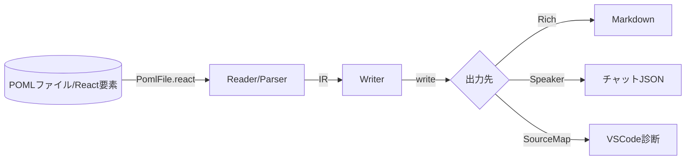

# POMLで実現する構造化プロンプト運用大全

最終更新日: 2025-09-20（コミット baad63a）、対象バージョン: 0.0.9

## 1. TL;DR
- POMLはHTMLライクなタグでプロンプト要素を分割し、役割・タスク・例示・入出力フォーマットを1ファイルで管理できるマークアップ言語です。
- `<document>`, ``, `<table>`などのコンポーネントによりPDF・画像・表データをシームレスに埋め込み、多モーダルLLMへの入力を安定化できます。
- テンプレート式（`<let>`, `for`, `if`）とCSS風スタイルシートで、内容と表現を分離しながら条件分岐や反復を記述できます。
- CLI/TypeScript/Python SDKとVS Code拡張が同じIRを書き換えるため、ローカル開発からLangChain・OpenAI Chat Completionまで一貫したワークフローを構築できます。
- JSON Schemaベースの`<output-schema>`、`charLimit`/`tokenLimit`、トレース機能により、生成結果を検証しつつ運用ログも収集できます。

## 2. 用語の定義
- **POMLファイル**: `.poml`拡張子で保存するプロンプトテンプレート。`<poml>`タグ配下に全要素を置くことでフル機能を利用できます。
- **コンポーネント**: `<role>`, `<example>`, `<document>`などドメインに特化したタグ群。属性で話者やフォーマット、ファイルパスを指定します。
- **スタイルシート**: `<stylesheet>`タグに書くJSON。CSSと同様にタグ名や`.className`で属性を一括変更し、表現ルールを共有します。
- **テンプレートコンテキスト**: `<let>`や`{{ expression }}`で参照する変数スコープ。外部JSON/CSVを`src`属性で読み込み、式から値を生成できます。
- **中間表現(IR)**: `PomlFile`が生成する内部XML。`write()`がこれを`RichContent`やスピーカーメッセージ列へ変換し、トレースやソースマップも付与されます。
- **リッチコンテンツ**: 文字列と画像メタデータからなる配列。OpenAIやLangChain用にPython APIが再フォーマットします。
- **ランタイムパラメータ**: `<runtime>`系メタデータ。CLI/SDKがAPIプロバイダー設定や温度などを取り出し、VS Codeテスターとも共有します。

## 3. 技術・実装解説
### 3.1 コアアーキテクチャ
TypeScriptコア（`packages/poml/index.ts`および`file.tsx`）は以下のパイプラインを採用しています。



- **Parser**: Chevrotainと`@xml-tools`でXML ASTを生成し、`autoAddPoml`によりフリーテキストも自動ラップします。`<meta>`により`minVersion`チェックやコンポーネントの有効/無効を制御します。
- **IR生成**: `StyleSheetProvider`がクラス名やタグごとの属性をマージし、`SourceProvider`が画像・文書の相対パスを解決します。`PomlFile`は`<output-schema>`をOpenAPI互換に変換し、`<tool-definition>`や`<runtime>`も抽出します。
- **Writer**: `writer.ts`が`js-tiktoken`で文字数とトークン数を測り、`priority`や`charLimit`/`tokenLimit`で段階的にトリミングします。マルチメディアは特殊プレースホルダー経由で所定位置に再配置され、ソースマップで元ソースの範囲を保持します。

### 3.2 コンポーネントとデータ統合
- `<document>`はプレーンテキスト・DOCX・PDFをラッピングし、必要に応じて`parser="pdf"`などでOCR/抽出方法を切替えます。
- ``/`<audio>`/`<video>`タグは`syntax="multimedia"`指定で実際のBase64を送信し、`alt`で視覚入力を持たないモデルにも説明を補完します。
- `<examples>`と`<example>`はFew-shot会話を自動でhuman/aiターンに展開します。`examples/101_explain_character.poml`のように画像とテキストを組み合わせたデモで挙動を確認できます。

### 3.3 テンプレート & スタイル
- `<let>`タグは値、JSON、外部ファイル（`src="users.json"`）の読み込み、さらには型指定（`type="integer"`）に対応します。
- `for="item in list"`、`if="condition"`属性で任意のタグに繰り返し・条件分岐を付与でき、`loop.index`などの内蔵変数が提供されます。
- `<stylesheet>`ではタグ名・`.class`に対して`syntax`, `writerOptions`, `charLimit`など任意の属性を一括付与できます。コンテンツとプレゼンテーションを分離し、出力先ごとに最適化する設計です。

### 3.4 長さと品質管理
- `docs/language/token.md`で説明されている通り、`charLimit`/`tokenLimit`は「優先度→トークン→文字」の順に適用されます。`writerOptions`の`truncateDirection`や`truncateMarker`で切り方も設定できます。
- `priority`属性が小さい要素から削除されるため、クリティカルな指示に大きな優先度を割り当てることで、トークン制限下でも壊れにくいプロンプトになります。

### 3.5 SDKとツールチェーン
- **TypeScript**: `npm install pomljs`でReact/JSXライクに`<Paragraph>`などのコンポーネントをインポートし、`read()`→`write()`で任意フォーマットに出力できます（`docs/typescript/index.md`）。
- **Python**: `poml.poml()`はNodeラッパーを内部で起動し、`format="openai_chat"`や`"langchain"`を指定するだけで各フレームワークのメッセージ形式へ自動変換します。`examples/404_travel_expense_agent.py`では`to_strict_json_schema()`でPydanticモデルをJSON Schema化し、複数のPOMLテンプレートを連鎖させています。
- **CLI**: `npx poml -f prompt.poml -c context.json --prettyPrint --speakerMode`のように使い、`--traceDir`を指定するとIR/結果/コンテキストがファイルに保存されます。
- **VS Code拡張**: シンタックスハイライト・プレビュー・モデルテスト・ギャラリーを提供し、設定（`poml.languageModel.*`）でAPIキーやプロバイダーを切替えられます。

### 3.6 トレースと運用フック
- Node側の`setTrace()`とPython側の`poml.set_trace()`は共通フォーマットで`*.poml`, `.context.json`, `.result.json`を吐き出し、AgentOps/Weave/MLflowへの転送オプションも備えています。
- `<runtime>`で定義したAPIパラメータはCLI結果の`runtime`キーに含まれ、LangSmithや自作ダッシュボードでも再利用可能です。

## 4. 現状できること/できないこと
**できること**
- `<output-schema>`でOpenAPI/JSON SchemaやZod式を定義し、Chat Completionの`response_format`や検証ロジックにそのまま渡せます。
- `<tool-definition>`でツール呼び出し契約を一元化し、Python APIがOpenAIのtool_calls配列へ変換します。
- `syntax="json"`, `syntax="markdown"`, `presentation="serialize"`などで、同じソースからチャット用テキストとマシン可読JSONの2系統を出力できます。
- VS Code拡張からPOMLギャラリーを読み込み、サンプルを即座にテストできます。
- `poml.util.trace`により、失敗したランを後から完全再現できます。

**まだ難しい/注意が必要なこと**
- フリーテキストモードは`<`や`&`などの文字が制限され、`#lt;`といった独自エスケープが必要です。可能な限り`<poml>`で囲んでください。
- TypeScript APIは「rapid development」中で破壊的変更の可能性があります。プロダクションではバージョンピン推奨です。
- トークン制御と`writerOptions`は実験的扱いで、将来仕様が変わる可能性があります。
- Python SDKは内部でNode CLIを呼び出すため、ローカルにNode.js環境が必要です。
- 大規模PDFや画像を大量に読み込むと、Base64化によってメモリフットプリントが増えるため適宜外部ストレージやストリーミング戦略が必要です。

## 5. 使い方解説
1. **環境準備**
   - Node.js 18+とPython 3.9+を用意。
   - TypeScript/Node: `npm install pomljs`。Python: `pip install poml`。
   - VS CodeユーザーはMarketplaceで「POML」を検索して拡張機能を追加し、`poml.languageModel.*`を設定します。
2. **テンプレート作成**
   - `.poml`ファイルを作り、`<poml>`直下に`<role>`, `<task>`, `<examples>`などを配置。
   - 外部データは`<let name="orders" src="orders.csv" type="csv"/>`で読み込み、`for="order in orders"`で反復できます。
3. **CLIでレンダリング**
   - `npx poml -f orders_bot.poml -c context.json --speakerMode --prettyPrint`でヒト/AIターンを確認。
   - `--traceDir pomlruns`を付けると、IRやレスポンスが`pomlruns/0001.*`として保存されます。
4. **Python統合**
   - `from poml import poml as render`として`render("orders_bot.poml", context={"orders": [...]}, format="openai_chat")`。
   - OpenAI SDKには`client.chat.completions.create(**rendered, model="gpt-4o-mini")`のように辞書をそのまま渡せます。
5. **TypeScript統合**
   - `import { Paragraph, Image, read, write } from 'poml/essentials'`。
   - `const ir = await read(<Paragraph>...</Paragraph>); const markdown = write(ir);`で構造化された出力を得ます。
6. **VS Codeでテスト**
   - `.poml`を開き、サイドバーの「POML Preview」または「Run Prompt」を実行。
   - モデル設定はワークスペースの`settings.json`で上書き可能。複数プロバイダーのAPIキーも辞書形式で保存できます。

## 6. よくあるQ&A
**Q1. POMLは普通のHTMLテンプレートと何が違いますか？**
A. HTMLはレンダリング対象がブラウザーであるのに対し、POMLはLLM入出力に特化し、`<role>`や`<output-schema>`などLLM固有の要素・属性を提供します。また、出力はMarkdownやJSONなど任意フォーマットに変換されます。

**Q2. 既存のプロンプトに少しずつPOMLを導入できますか？**
A. 可能です。ファイル先頭に`<poml>`を足し、主要な指示を`<task>`や`<hint>`に移すところから始めると移行コストを抑えられます。スタイルシートで元の書式に近い出力を再現できます。

**Q3. JSON Schemaが長すぎるとトークンを圧迫しませんか？**
A. `priority`を低く設定し、`tokenLimit`付きの`<hint>`にスキーマを入れることで他セクションを保護できます。あるいは`<document src="schema.json"/>`で外部化し、必要な時だけ差し込む運用も推奨です。

**Q4. 画像やPDFを含むプロンプトでAPIコストが跳ね上がります。対策は？**
A. ``で画像をまとめて冒頭に置き、必要な場合だけ`if`条件で切り替えましょう。`<document parser="pdf" tokenLimit="500">`で抜粋を自動制限する方法もあります。

## 7. 終わりに
POMLは「プロンプトをコードとして扱う」ための型・ツール・運用基盤を丸ごと提供します。テンプレートと実行環境を分離しつつ、SchemaやトレースでLLMの不確実性を抑えられる点が最大の価値です。まずはサンプルをコピーし、独自の`<stylesheet>`や`<output-schema>`を差し替えてみてください。

## 8. 付録（ハンズオンコード）
### 8.1 POMLテンプレート例 `appendix_expense_guardrail.poml`
```xml
<poml>
  <meta minVersion="0.0.9" />
  <stylesheet>
    {
      "cp": { "captionStyle": "header" },
      ".guard": { "syntax": "markdown", "priority": 5 }
    }
  </stylesheet>
  <let name="line_items" src="data/line_items.json" />
  <role>あなたは財務部門の監査官です。</role>
  <task>与えられた経費精算をレビューし、違反があれば修正案を提示してください。</task>
  <hint className="guard">
    - 1日の宿泊費上限は 250 USD。
    - 領収書が無い支出はすべて却下。
  </hint>
  <examples>
    <example caption="良い例">
      <input>領収書があり、規定内の宿泊でした。</input>
      <output>問題なしと判断し、承認しました。</output>
    </example>
  </examples>
  <output-schema parser="json">
    {
      "type": "object",
      "properties": {
        "decision": { "type": "string", "enum": ["approve", "fix", "reject"] },
        "findings": {
          "type": "array",
          "items": {
            "type": "object",
            "properties": {
              "category": { "type": "string" },
              "evidence": { "type": "string" },
              "recommendation": { "type": "string" }
            },
            "required": ["category", "evidence"]
          }
        }
      },
      "required": ["decision"]
    }
  </output-schema>
  <section caption="各明細">
    <cp for="item in line_items" caption="{{ item.date }} {{ item.category }}">
      <list>
        <item>金額: {{ item.amount }} {{ item.currency }}</item>
        <item>領収書: {{ item.has_receipt ? 'あり' : 'なし' }}</item>
        <item>備考: {{ item.notes }}</item>
      </list>
    </cp>
  </section>
</poml>
```

### 8.2 Pythonランナー例 `appendix_runner.py`
```python
from pathlib import Path
from poml import poml as render, set_trace

DATA_DIR = Path("data")


def build_context() -> dict:
    """APIキーを含まない実行時パラメータを組み立てる。"""
    items = DATA_DIR / "line_items.json"
    return {"line_items": items.read_text(encoding="utf-8")}


def main() -> None:
    """POMLテンプレートをOpenAI互換のチャット形式に変換し、JSONをファイルに保存する。"""
    set_trace(trace_dir="pomlruns")  # 生成物を追跡
    context = build_context()  # 実データをロード
    result = render(
        "appendix_expense_guardrail.poml",
        context=context,
        format="openai_chat",
        chat=True,
    )
    output_path = Path("poml_output.json")
    output_path.write_text(str(result), encoding="utf-8")
    print(f"書き出し完了: {output_path}")


if __name__ == "__main__":
    main()
```

### 8.3 実行方法
1. `pip install poml openai` を実行。
2. `python appendix_runner.py` を走らせ、`poml_output.json`と`pomlruns/`配下のトレースを確認。
3. OpenAI SDKに渡す場合は、`client.chat.completions.create(**result, model="gpt-4o-mini")`のように辞書を展開してください。
