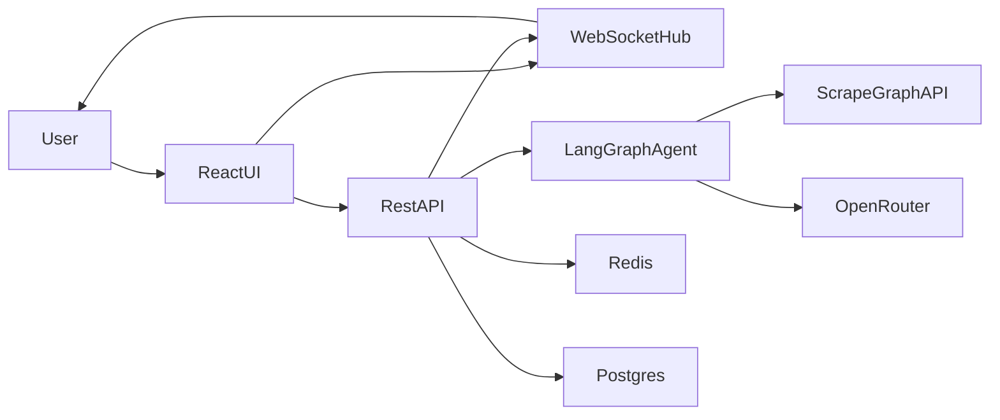

# ScrapeCraftでAIスクレイピングを味方につける：会話型パイプライン構築のすべて

最終更新日: 2025-10-26（コミット d39d969a）、対象バージョン: 1.0.0

## 1.これはなに？
ScrapeCraftは、Cursor風の開発体験をそのままスクレイピングに持ち込むためのWeb編集環境です。React + FastAPI構成のエディタから会話すると、バックエンド側のLangGraphベースAIがURL収集・スキーマ設計・コード生成・実行までを順番に支援し、複数URLのパイプラインを整理しながらScrapeGraphAI APIでデータ抽出できます（[ScrapeCraft GitHub README](https://github.com/ScrapeGraphAI/scrapecraft)）。

## 2.用語の定義
- **ScrapeGraphAI SmartScraper**: HTMLに依存せず自然言語プロンプトとPydanticスキーマを受け取って構造化JSONを返すAPI。ScrapeCraftはこのAPIを最終的な抽出エンジンとして利用します（[ScrapeGraphAI Docs – SmartScraper](https://docs.scrapegraphai.com/services/smartscraper)）。
- **scrapegraph_py AsyncClient**: ScrapeGraphAI公式Python SDKの非同期クライアント。複数URLを`asyncio.gather`で同時処理でき、ScrapeCraftの`ScrapingService`もこの実装を直接呼び出します（[ScrapeGraphAI Docs – Python SDK](https://docs.scrapegraphai.com/sdks/python)）。
- **OpenRouter / Kimi-k2**: バックエンド設定でOpenRouterの`moonshotai/kimi-k2`エンドポイントをデフォルトLLMとして指定し、会話型アシスタントの全応答をこのモデル経由で生成します（[`backend/app/config.py`](https://github.com/ScrapeGraphAI/scrapecraft/blob/main/backend/app/config.py#L14-L24)）。
- **Moonshotのオープン化 (2025-07-11)**: 中国のMoonshot AIは2025年7月11日にKimi K2のオープンウェイトを公開し、競争激しい国内市場での再浮上を狙っています（[Reuters: China’s Moonshot AI releases open-source model to reclaim market position](https://www.reuters.com/business/media-telecom/chinas-moonshot-ai-releases-open-source-model-reclaim-market-position-2025-07-11/)）。

## 3.技術・仕組み解説
### 3.1 バックエンド（FastAPI）
- `backend/app/main.py`がFastAPIアプリを起動し、CORS許可・RESTルーター・WebSocket `/ws/{pipeline_id}`を一元登録します。
- ルーター群：`app/api/pipelines.py`はパイプラインCRUD、`chat.py`はAI応答、`execution.py`は生成コードの安全実行（テンポラリファイル+`asyncio.create_subprocess_exec`）を担当します。
- `app/services/scrapegraph.py`の`ScrapingService.execute_pipeline()`は`AsyncClient`でURLごとに`smartscraper`を並列呼び出し、例外を握りつぶさずURL単位の成功/失敗を返す実装です。
- `app/agents/unified_agent.py`はRedisにコンテキストを保持しつつ、意図推定→類似パイプライン検索→行動（URL追加/スキーマ作成/コード生成）を切り替える総合エージェントです。ここでPatternLearnerやPipelineRepositoryをDIできるようになっており、記憶ベースで提案を洗練させる設計になっています。

### 3.2 ワークフローとリアルタイム性
- `app/models/workflow.py`は`WorkflowPhase`列挙と`WorkflowState`を定義し、URL収集→検証→スキーマ検証→コード生成→実行の進捗を百分率で可視化できるようになっています。
- `app/services/workflow_manager.py`はLangGraphエージェント（`app/agents/langgraph_agent.py`）の結果を受けて`WorkflowState`を更新し、必要に応じて承認待ちイベントを発火。`ConnectionManager`経由でWebSocketに`workflow_update`イベントを投げるため、フロントは状態をリアルタイム追従できます。
- `app/api/execution.py`ではユーザー生成コードをそのまま実行せず、APIキーやURLリストを安全に差し込んだテンポラリファイルを生成してから別プロセスで実行することで、例外や標準出力のパースを容易にしています。

### 3.3 フロントエンド（React + Zustand）
- `frontend/src/App.tsx`は初回ロード時にパイプラインを自動作成し、`useWebSocket`で指定IDのWebSocketに接続してステートを監視します。
- `frontend/src/store/pipelineStore.ts`（Zustand）はREST APIに対するCRUDを1か所でラップし、パイプラインの状態と実行結果を管理。`runPipeline`メソッドは`/api/execution/execute`にPOSTして結果をストアへ反映します。
- `frontend/src/store/websocketStore.ts`は指数バックオフ付き再接続、`workflowStore`（動的import）更新、チャットログ送信をまとめています。これにより承認ダイアログや実行ログが即座に描画されます。

### 3.4 デプロイ/自動更新
- ルート直下の`docker-compose.yml`はFastAPI、React静的ホスト、PostgreSQL、Redis、Watchtowerを束ねます。クライアントサイドの`REACT_APP_API_URL`と`REACT_APP_WS_URL`はCompose環境変数で注入されるので、`.env`にAPIキーだけを置けば即座にローカルで試せます。
- Watchtowerサービスが5分間隔で新しいコンテナイメージを検知し自動更新するため、SaaSライクに継続デプロイできます。

### 3.5 関係図


## 4.現状できること/できないこと
- **できること**
  - 複数URLの収集とスキーマ定義を会話ベースで進め、`ScrapingService`が`asyncio.gather`で同時実行することで高速に結果を返せます。
  - `WorkflowState`で各フェーズの承認や差し戻し履歴を残せるため、チーム作業でも作業理由が追跡できます。
  - `execution.py`経由で生成コードをそのまま手元で確認でき、標準出力からJSONを抽出する仕組みによりフロントも結果をテーブル表示できます。
- **これからの課題**
  - `app/api/pipelines.py`は現状インメモリ辞書`pipelines_store`を利用しており、PostgreSQLへの永続化は未実装です。
  - `chat.py`や`workflow_manager.py`には「TODO」や未実装メソッドが残っており、履歴のDB保存・PipelineRepositoryの本実装などが必要です。
  - エージェントの`pattern_learner`はRedisキャッシュを初期化するだけで、学習結果を永続テーブルに書き戻す処理はまだ雛形段階です。

## 5.使い方解説
1. リポジトリを取得し、環境変数ファイルを整える。
   ```bash
   git clone https://github.com/ScrapeGraphAI/scrapecraft.git
   cd scrapecraft
   cp .env.example .env
   # OPENROUTER_API_KEY / SCRAPEGRAPH_API_KEY / JWT_SECRET を編集
   ```
2. Docker Composeでまとめて起動する。
   ```bash
   docker compose up -d
   ```
3. ブラウザで`http://localhost:3000`にアクセスし、初期パイプラインが作成されるのを待つ。
4. 左ペインでURLやスキーマを入力/会話し、右ペインでAIログやコードを確認。
5. 「Run Pipeline」を実行すると、WebSocketストリームで結果が流れ、テーブルやJSONビューで検証できます。
6. 開発モードで細かく触りたい場合は`backend/`で`uvicorn app.main:app --reload`、`frontend/`で`npm start`を起動すればホットリロードできます。

## 6.よくあるQ&A
- **Q. APIキーは毎回入力する必要がありますか？**  
  `.env`に設定したサーバーサイドのキーが既定値になりますが、フロントの「Settings」からローカルストレージにユーザー固有キーを保持して上書きできます。
- **Q. 同じようなスクレイピング要求を再利用できますか？**  
  `UnifiedScrapingAgent`がRedisに会話コンテキストを7日保持し、`pattern_learner`がドメインごとの共通スキーマを学習する設計なので、似たリクエストほど提案が早くなります。
- **Q. 途中で承認が止まった場合は？**  
  WebSocket経由で`approval_request`イベントが届き、`frontend/src/components/Workflow/ApprovalManager.tsx`がモーダルを出します。承認/却下すると`workflow_manager`がフェーズを進め直します。
- **Q. 実行ログはどこに残りますか？**  
  現状はRedis＋WebSocket経由でブラウザにストリームされた内容のみです。恒久保存したい場合は`ExecutionResponse`をDBへ書き込む処理を追加する必要があります。

## 7.終わりに
ScrapeCraftはエージェント×スクレイピングという新しいカテゴリを切り開く実験的なOSSです。Kimi-k2やWatchtowerのような最新基盤と、LangGraph/Redis/PostgreSQLといった堅実なスタックを組み合わせることで、手作業でのスクレイピング設計を「会話しながら作る体験」に置き換えようとしています。まずはローカル環境でパイプライン生成→実行の一連を試し、足りない永続化や監査ログを自分のニーズに合わせて拡張してみてください。

## 8.付録：すぐ試せるコード例
```python
"""ScrapeGraphAIとScrapeCraftの設計方針を踏まえた最小実行サンプル"""
import asyncio
from typing import List
from pydantic import BaseModel, Field
from scrapegraph_py import AsyncClient

class ProductSchema(BaseModel):
    """製品名・価格・在庫を整理するためのシンプルなスキーマ"""
    name: str = Field(description="商品名")
    price: str = Field(description="表示価格の文字列")
    availability: str = Field(description="在庫状況や配送情報")

async def scrape_catalog(urls: List[str], api_key: str) -> List[dict]:
    """指定URL群をSmartScraperで巡回し、構造化データを返す非同期関数"""
    async with AsyncClient(api_key=api_key) as client:
        tasks = []
        for url in urls:
            # メンテしやすいようにプロンプトを共通化
            prompt = (
                "Extract product name, price, and availability. Return concise Japanese summaries."
            )
            tasks.append(
                client.smartscraper(
                    website_url=url,
                    user_prompt=prompt,
                    output_schema=ProductSchema
                )
            )
        # ScrapeCraft本体と同じく並列実行でレスポンスを集約
        raw_results = await asyncio.gather(*tasks, return_exceptions=True)
        cleaned = []
        for url, result in zip(urls, raw_results):
            if isinstance(result, Exception):
                cleaned.append({"url": url, "success": False, "error": str(result)})
            else:
                cleaned.append({"url": url, "success": True, "data": result})
        return cleaned

async def main():
    """サンプルパイプラインを1回実行し標準出力に整形して表示する"""
    urls = [
        "https://example.com/products/camera",
        "https://example.com/products/laptop"
    ]
    api_key = "your-real-scrapegraph-key"
    results = await scrape_catalog(urls, api_key)
    for item in results:
        if item["success"]:
            print(f"✅ {item['url']}: {item['data']}")
        else:
            print(f"⚠️ {item['url']} - {item['error']}")

if __name__ == "__main__":
    asyncio.run(main())
```
