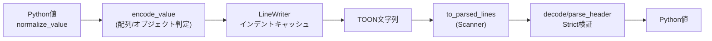

# LLMコンテキストを半分に圧縮するtoon-pythonのすべて
最終更新日: 2025-11-09（コミット 6cf4d7f）／対象バージョン: 0.9.0-beta.1 `pyproject.toml:3`

## 1. TL;DR
- toon-pythonはv0.9系ベータで仕様追従の途中段階ながら、JSONより30〜60%トークンを削減できる軽量フォーマット実装です `README.md:6` `README.md:8`
- エンコード処理は normalize → encode_value → LineWriter というシンプルな三段構成で、Python固有値の正規化や配列フォーマットの自動判別を担います `src/toon_format/encoder.py:19` `src/toon_format/encoders.py:103` `src/toon_format/normalize.py:36`
- デコーダは行スキャナとstrictモード検証でインデント・配列長・区切り文字を全てチェックし、壊れたTOONを即座に弾きます `src/toon_format/_scanner.py:1` `src/toon_format/decoder.py:231` `docs/api.md:132`
- CLI/トークン計測/公式フィクスチャテストが同梱されており、LLM統合〜回帰テストまでワンストップで回せます `src/toon_format/cli.py:19` `src/toon_format/utils.py:65` `tests/test_spec_fixtures.py:1`

## 2. 用語の定義
| 用語 | 平易な説明とたとえ | 典拠 |
| --- | --- | --- |
| TOON (Token-Oriented Object Notation) | YAMLのように縮んだインデント＋CSV風ヘッダーでデータを「厨房の伝票」みたいに省スペースに書くフォーマット。 | `docs/format.md:11`
| Tabular配列 | 全て同じフィールドを持つ辞書リストを、ヘッダー付きの「大皿盛り」で並べるモード。LLMに人数・列数を明示できる。 | `docs/format.md:99`
| 長さマーカー (`[#N]`) | 配列行の冒頭に#付きで要素数を書く「注文数メモ」。モデルやパーサが数違いを検知できる。 | `docs/api.md:83`
| Strictモード | デコーダ側の「料理長」で、インデントずれ・配列長不一致・空行混入を即エラーにします。ルーズにしたい時は`strict=False`に下げる。 | `docs/api.md:132`
| Token計測ユーティリティ | `count_tokens`/`estimate_savings`/`compare_formats`で、TOONがどれくらい原価(トークン)を節約したかを即時試算する道具。 | `docs/api.md:247`

## 3. 技術・実装解説
### 3.1 エンコードパイプライン
1. `encode()`が入力を受け取り、Python固有型をISO文字列やリストへ畳み込む`normalize_value()`を通します。大きな整数や`datetime`/`Decimal`もここでJS互換な形に変換されます。 `src/toon_format/encoder.py:19` `src/toon_format/normalize.py:36`
2. 正規化済みデータは`encode_value()`でオブジェクト/配列/プリミティブごとの最適レイアウトへ振り分けられ、空配列や混在リストでも自動的にタブラー判定が走ります。 `src/toon_format/encoders.py:33` `src/toon_format/encoders.py:103`
3. 配列ヘッダーの検出(`detect_tabular_header`)や`LIST_ITEM_PREFIX`の付け方など、表現揺れを排除するロジックが集中しており、列順序は最初の要素を基準に固定されます。 `src/toon_format/encoders.py:274`
4. 仕上げは`LineWriter`。インデント幅0でも構造が崩れないように最小1スペースを保証しつつ、キャッシュしたインデント文字列で大量の行を高速に連結します。 `src/toon_format/writer.py:14`


上図の通り、エンコードとデコードは鏡写しで、中央に文字列という唯一のI/O境界だけが存在します。

### 3.2 デコーダとStrict検証
- `decode()`は入力を`to_parsed_lines()`に渡し、行単位にインデント深度を付与した`ParsedLine`へ変換します。タブや不正なスペース幅はこの段階でSyntaxError化されます。 `src/toon_format/_scanner.py:1`
- その後`parse_header()`で`[N]`ヘッダーと区切り文字、オプションのカラム名を解析し、`decode_array_from_header()`がインライン配列・タブラー配列・リスト配列を振り分けます。 `src/toon_format/decoder.py:105` `src/toon_format/decoder.py:382`
- インライン配列は宣言長と実際の値数を比較し、strictモードでは不一致時に`ToonDecodeError`を投げます。 `src/toon_format/decoder.py:454`
- リスト形式の配列(`- item`)は入れ子オブジェクトや配列を再帰的にたどり、項目ごとに`split_key_value`でキー/値を切り出します。 `src/toon_format/decoder.py:590`

### 3.3 正規化・クオート・文字列処理
- `primitives.py`では、科学表記になりがちな浮動小数をDecimal経由で通常表記に戻し、文字列は`is_safe_unquoted`を通ったものだけ素のまま出力するため、要件通り「必要なときだけ引用符」を実現しています。 `src/toon_format/primitives.py:46`
- 引用ルール自体は仕様書にも丁寧に例示されているので、モデルトレーニング時はこの表を提示するだけで済みます。 `docs/format.md:227`

### 3.4 テストとスペック準拠
- GitHubの公式フィクスチャ(JSON)を全件流す`tests/test_spec_fixtures.py`により、エンコード・デコードのどちらも仕様逸脱がないかを常時チェックできます。 `tests/test_spec_fixtures.py:1`
- フィクスチャ自体は`tests/README.md`でカテゴリごとに整理されており、新しいケースを追加する手順も明文化されています。 `tests/README.md:1`
- セキュリティ面は別途`tests/test_security.py`でリソース枯渇やインジェクション系の異常系を網羅し、巨大データでも落ちないことを検証しています。 `tests/test_security.py:13`

### 3.5 LLM連携ユーティリティ
- `count_tokens`/`estimate_savings`/`compare_formats`はtiktokenバックエンドを透過的に扱い、どの程度コンテキストを節約できたかをプログラムから即レポートにできます。 `src/toon_format/utils.py:65`
- ドキュメントにはPromptテンプレや失敗時のリカバリ手順まで掲載されているので、LLMへの指示文テンプレを丸ごと引用して導入できます。 `docs/llm-integration.md:32`

### 3.6 なぜTOONはトークンを削減できるのか
1. **引用と記号を最小化する構文**: JSONはすべてのキー・文字列を`"`で囲み、 `{}` や `[]`、カンマを多用します。一方TOONは `key: value` とインデントで階層を示し、必要な場合しか引用しないため、構造用トークンそのものが減ります。空白も固定インデントだけなので、LLMトークナイザで無視されやすいスペースに置き換えられます。 `docs/format.md:11` `docs/format.md:227`
2. **Tabular配列でラベルを一度だけ宣言**: 均質な配列は `[N,]{id,name}` のようにヘッダーへ列名を一度書けば、各行は値のみを並べればよい構造です。JSONのように `{"id": 1, "name": "Alice"}` を毎行繰り返さないので、列名トークンの再利用により20〜40%以上の削減が発生します。 `docs/format.md:99`
3. **長さマーカーとリスト記号で括弧を代替**: `[N]` と `-` の組み合わせで配列境界が明確になるため、開閉括弧・カンマの繰り返しをほぼ不要にできます。結果として構造情報を示すための記号列が短くなります。 `docs/api.md:81`
4. **デリミタ選択による追加エスケープ削減**: `delimiter` を `,` / `\t` / `|` から選べるため、値内部とデリミタが衝突しにくくなり、不必要なクオートやエスケープ記号を避けられます。 `docs/api.md:81`
5. **実測で30〜60%削減**: READMEのベンチ結果では同じユーザリストをJSONで45トークン、TOONで28トークンと報告しており、`estimate_savings`/`compare_formats` を使えば自分のデータでも同様の差分をすぐ算出可能です。 `README.md:81` `src/toon_format/utils.py:65`

このように「表現の重複を排除し、構造を一度だけ宣言する」哲学がトークン削減を生むため、TOON化するだけでプロンプト長が自動的に圧縮されます。

### 3.7 LLMがTOONを理解できる理由
1. **既存フォーマットとの親和性**: LLMは学習段階でJSONやYAMLの大量サンプルを読んでおり、`key: value` やインデントで階層を表す構文は既知です。TOONはこれらの派生形なので、数行の例示で即座にパターンを習得できます。 `docs/llm-integration.md:5`
2. **Promptテンプレが提供されている**: 公式LMMガイドには、TOONの書き方（`[N]` 長さマーカー、Tabular配列、引用ルール等）を列挙したテンプレートが掲載されており、そのまま system prompt に貼るだけでモデルへフォーマット指示ができます。 `docs/llm-integration.md:32`
3. **Few-shot例とバリデーション手順**: ドキュメントにはTOONでの入出力例と、エラー時に「長さが合いません」と再生成させるプロンプト例まで載っています。これにより、フォーマットを知らないモデルでも数ショットで遵守させつつ、`decode(strict=True)` で検証→再依頼というフローを組めます。 `docs/llm-integration.md:295` `docs/llm-integration.md:370`
4. **実運用向けユースケース集**: 構造化データ抽出や設定生成など、TOONを使った現実的プロンプトが複数提示されているため、プロンプトをコピー＆アレンジするだけでLLM側の学習を最小化できます。 `docs/llm-integration.md:202`

こうしたサンプルと検証フローが揃っているため、「TOONの読み方を知らないと使えないのでは」という懸念に対して、実際にはPrompt設計で十分補えるといえます。

## 4. 現状できること / できないこと
**できること**
- YAML+CSVハイブリッドの文法で、ネストオブジェクト・配列・表形式をシームレスに表現できる。 `docs/format.md:11`
- CLIが拡張子や入力内容から自動でエンコード/デコードを判定し、区切り文字やインデント、長さマーカーもフラグ一つで制御可能。 `src/toon_format/cli.py:19`
- 792件のテストとカバレッジ計測、Ruff/Mypyによる品質チェックがコマンドひとつで走り、CIも同構成です。 `README.md:131`
- 仕様フィクスチャのJSON Schemaが揃っているので、他言語実装との整合を自動で確認可能。 `tests/README.md:16`

**できない／今後の予定**
- まだv0.9系ベータのためAPI互換は確定しておらず、1.0までは破壊的変更が入る可能性があります。 `README.md:6`
- 公式サイトや包括的ベンチマークはロードマップ上のTODOで、現在はMarkdownドキュメント＋簡易表に留まります。 `docs/README.md:63`
- トークン計測系は`tiktoken`を別インストールしないと使えないため、オフライン環境ではベンチ機能が無効になります。 `docs/api.md:263`

## 5. 使い方解説
1. **セットアップ**: `uv sync`で依存関係を解決し、`uv run pytest`で環境が壊れていないことを確認します。 `README.md:125`
2. **基本API**: `from toon_format import encode, decode`でPython辞書をTOONへ、TOON文字列を辞書へ往復できます。 `README.md:22`
3. **CLI運用**: ファイル拡張子や標準入力のJSON/TOON判定は自動化されています。明示的に指定したい場合は`toon data.json --encode --delimiter "\t" --length-marker`のようにフラグを足してください。 `README.md:43` `src/toon_format/cli.py:97`
4. **オプション設計**: `EncodeOptions`/`DecodeOptions`でインデント幅や長さマーカー、strictモードに触れられます。TypedDict＆クラスなのでmypyでも型安全に扱えます。 `docs/api.md:81`
5. **トークン比較**: `estimate_savings`でJSON/TOONそれぞれのトークン数と削減率を取得し、コスト試算を自動化します。 `README.md:81`
6. **LLM統合**: ドキュメントのサンプルプロンプトをそのままsystem promptに貼り、長さマーカーを必須条件にすることでモデル由来のフォーマット崩れを抑えられます。 `docs/llm-integration.md:32`
7. **検証**: 仕様準拠を確認したければ`pytest tests/test_spec_fixtures.py -k encode`などで対象カテゴリのみ実行し、意思疎通しづらいケースを再現できます。 `tests/test_spec_fixtures.py:68`

### 5.1 JSON→TOON比較例
同じユーザ一覧をJSONとTOONで表した最小例を示します。ヘッダー部に列名と長さを一度だけ宣言するだけで、TOONでは繰り返しのキー記述を省けることが分かります。 `docs/format.md:99`

```json
{
  "users": [
    {"id": 1, "name": "Alice", "age": 30},
    {"id": 2, "name": "Bob", "age": 25},
    {"id": 3, "name": "Charlie", "age": 35}
  ]
}
```

```toon
users[3,]{id,name,age}:
  1,Alice,30
  2,Bob,25
  3,Charlie,35
```

ここの `users[3,]{…}` は **3件の行（ユーザ数）** を意味し、カンマの後ろに `{id,name,age}` という3列ヘッダーが続く構造です。つまり最初の数字は全要素数を、波括弧内は列名（＝カラム数）を表すため、どちらも読み取れるように分離されています。 `docs/format.md:99`

上記は `encode()` へ同じPython辞書を渡すだけで生成できます。CLIでも `toon data.json -o data.toon` と実行すれば自動判別してくれるため、既存JSON資産を段階的にTOON化できます。 `README.md:22` `src/toon_format/cli.py:19`

### 実行例
```bash
# JSON→TOON
uv run toon data.json -o data.toon
# TOON→JSON（lenient）
uv run toon data.toon --no-strict -o roundtrip.json
# ベンチマーク
python - <<'PY'
from toon_format import estimate_savings
print(estimate_savings({"users": [{"id": 1, "name": "Alice"}] }))
PY
```

## 6. 終わりに
LLMの入力コストが肥大化するほど、構造化テキストを無駄なく詰め込むことが重要になります。toon-pythonは標準ライブラリ的な軽さで導入でき、CLI・API・テスト・LLMガイドが一括提供されています。まずはタブラー配列でログやテーブルを移行し、削減率を可視化しながら徐々にprompt全体をTOON化するとスムーズです。

## 7. 付録: すぐ試せるコード一式
以下は社内指標データをTOON化し、LLMへ送る前に差分を検証するスクリプトです。各関数には日本語docstringを付け、コメントで意図を補足しています。

```python
"""TOONフォーマットの体験用スクリプト。`python appendix.py`で実行できます。"""

from pathlib import Path
from typing import Any, Dict, List

from toon_format import compare_formats, decode, encode, estimate_savings

RAW_REPORT: List[Dict[str, Any]] = [
    {"id": 1, "name": "Alice", "score": 0.91, "team": "blue"},
    {"id": 2, "name": "Bob", "score": 0.88, "team": "red"},
    {"id": 3, "name": "Cathy", "score": 0.73, "team": "blue"},
]


def build_board_payload(users: List[Dict[str, Any]]) -> str:
    """メトリクス一覧をTOONに変換し、長さマーカー付き文字列を返します。"""

    toon = encode({"scores": users}, {"lengthMarker": "#"})
    Path("board.toon").write_text(toon, encoding="utf-8")
    return toon


def verify_before_llm(toon_payload: str) -> None:
    """LLMに投げる前に、デコード結果とトークン削減率をログ出力します。"""

    restored = decode(toon_payload)
    savings = estimate_savings(restored)
    print("== Restored ==", restored)
    print("== Savings ==", f"{savings['savings_percent']:.1f}%")
    print(compare_formats(restored))


def main() -> None:
    """エントリーポイント。TOON化→保存→検証の流れを一気に実行します。"""

    # 1. エンコードしてファイルに保存
    toon_payload = build_board_payload(RAW_REPORT)

    # 2. 復元しつつ差分を表示
    verify_before_llm(toon_payload)

    # 3. LLMへ渡す際は toon_payload をそのまま system/user メッセージに埋め込みます


if __name__ == "__main__":
    main()
```

> 使い方
> 1. 上記コードを `appendix.py` に保存
> 2. `uv run python appendix.py` を実行
> 3. `board.toon` とトークン比較表が生成されます
